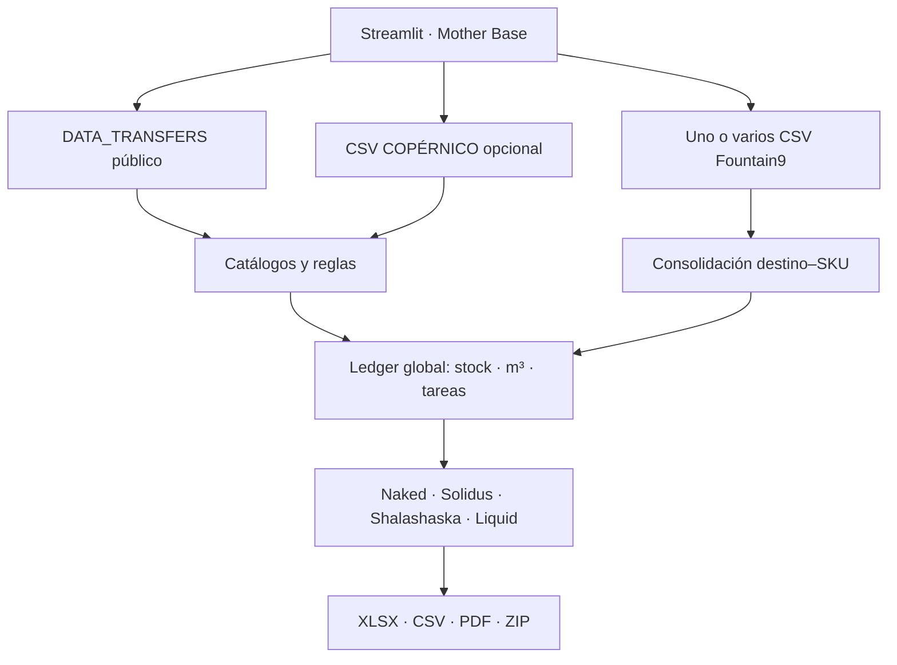

# MOTHER BASE

Centro de comando de Supply para planear transferencias entre centros de distribución y tiendas.

Mother Base es una aplicación web construida con Streamlit. Su módulo operativo, **Les Enfants Terribles**, consolida recomendaciones de Fountain9, valida los catálogos de negocio, descuenta inventario no utilizable, asigna mercancía desde uno o varios warehouses origen y genera entregables operativos y ejecutivos.

- Repositorio: [bryanzuniga-rappi/MOTHER_BASE](https://github.com/bryanzuniga-rappi/MOTHER_BASE)
- Aplicación: [mother-base.streamlit.app](https://mother-base.streamlit.app/)

> **Fuente mandante de inventario:** la cantidad máxima que puede salir de cualquier origen siempre parte de `STOCK.STOCK_DISPONIBLE_FINAL`. Ningún engine, archivo de Fountain9, registro de POR_MERMAR, COPÉRNICO u OWNER puede aumentar ese techo.

---

## 1. Estado y alcance

### Disponible actualmente

- Puerta de acceso Mother Base con perfiles **Big Boss** y **Raiden**.
- Módulo de planeación **Les Enfants Terribles**.
- Interfaz de planeación **Outer Heaven**.
- Panel de variables compartidas **CODEC**.
- Cuatro engines activables: Naked, Solidus, Shalashaska y Liquid.
- Lectura automática del Google Sheet público `DATA_TRANSFERS`.
- Panel visual de salud de todas las fuentes.
- Carga opcional de un CSV de COPÉRNICO.
- Carga y consolidación de uno o varios CSV de Fountain9.
- Restricciones de stock, capacidad, tareas, rutas, ciudades, tiendas y productos.
- Separación de entregables por owner para los orígenes 425 y 856.
- Reporte Excel, PDF ejecutivo, archivos CSV por origen/owner y ZIP consolidado.

### En construcción o reservado

- **Militaires Sans Frontières**: módulo de reporting histórico. Su tarjeta existe, pero continúa como `WORK IN PROGRESS`.
- Uso futuro de `STOCK.INCOMING`.
- `OVER_ORIGEN_STORAGE`: su compatibilidad permanece en backend, pero no es obligatorio y la interfaz lo mantiene desactivado.
- Diferenciación funcional completa entre Big Boss y Raiden. Hoy ambos pueden ejecutar las mismas operaciones; Raiden utiliza una espera operativa adicional de 10 segundos antes de ejecutar.

---

## 2. Principios mandantes

Estas reglas forman parte del contrato del sistema y deben preservarse en cualquier despliegue o refactorización:

1. **STOCK es mandante.** Nunca se asignan más unidades que el stock final ajustado del origen.
2. **Los bloqueos explícitos no se saltan.** Ningún engine puede ignorar tiendas cerradas, ciudades bloqueadas, rutas de costos, exclusiones manuales, productos excluidos ni bloqueos regionales aplicables.
3. **La capacidad es estricta.** Ninguna asignación puede provocar que una tienda exceda su capacidad en m³.
4. **El límite de tareas es compartido.** Naked, Solidus, Shalashaska y Liquid consumen un solo presupuesto global.
5. **Una tarea es una línea origen–destino–SKU.** Agregar unidades a una combinación existente no genera otra tarea.
6. **Prioridad absoluta de producto:** Infaltable, Golden, Anchor, KVI y Regular.
7. **Prioridad de tienda ascendente.** La prioridad `1` se atiende antes que la `100`.
8. **Golden no bloquea rutas.** Ser Golden o Infaltable aumenta prioridad, pero no crea una restricción geográfica.
9. **COPÉRNICO no sustituye STOCK.** Solo descuenta ubicaciones no pickeables y puede determinar el ambiente del 856.
10. **POR_MERMAR no sustituye STOCK.** Solo propone inventario en riesgo que se intentará evacuar.
11. **OWNER no sustituye STOCK.** Separa inventario y archivos de 425/856; el menor entre STOCK ajustado y OWNER es el límite.
12. **INSUMOS no consume tareas**, pero sí respeta stock de 444, MOQ y elegibilidad.

---

## 3. Arquitectura y flujo



La aplicación trabaja por sesión de Streamlit:

- Descarga `DATA_TRANSFERS` y valida sus fuentes.
- Conserva la base validada en caché durante la sesión.
- Solo vuelve a validarla cuando inicia una sesión nueva, vence la caché o el usuario presiona **Volver a validar la base**.
- Guarda uploads y resultados en un directorio temporal del servidor.
- Expone los resultados como descargas; no los persiste automáticamente en Google Drive.

### Secuencia real de una corrida

1. Autenticación y selección de módulo.
2. Descarga y validación de `DATA_TRANSFERS`.
3. Carga opcional de COPÉRNICO.
4. Carga de uno o varios CSV de Fountain9.
5. Captura de CODEC y activación de engines.
6. Consolidación de Fountain9 por destino–SKU.
7. Exclusión de outliers, tiendas, ciudades y SKUs.
8. Planeación base Naked y protecciones manuales Solidus.
9. Ejecución opcional de Shalashaska.
10. Cobertura opcional AVL y prevención de quiebres de Solidus.
11. Ejecución opcional de Liquid.
12. Partición OWNER para 425/856.
13. Normalización de STORAGE y etiquetas de reporting.
14. Incorporación opcional de INSUMOS al `BulkCD_444.csv`.
15. Generación de Excel, CSV, PDF y ZIP.

> La jerarquía de producto es más fuerte que la separación Naked/Solidus. Dentro de una misma categoría se atiende primero el ROQ natural, pero un Infaltable protegido puede adelantarse a un producto Regular con ROQ natural.

---

## 4. Estructura del repositorio

```text
mother_base/
├── .streamlit/
│   ├── config.toml                 # Tema, seguridad y límites de upload
│   └── secrets.toml.example        # Ejemplo de secreto local
├── engines/
│   ├── mission_control.py          # Selección Naked/Solidus de la cola base
│   ├── naked_engine.py             # Clasificación de ROQ natural
│   ├── solidus_engine.py           # Clasificación de protecciones manuales
│   ├── shalashaska_engine.py       # Evacuación de inventario por mermar
│   └── liquid_engine.py            # Liquidación de remanentes
├── modules/
│   ├── les_enfants_terribles.py    # UI, orquestación, analítica y outputs web
│   └── militaires_sans_frontieres.py
├── tests/                          # Pruebas del comportamiento crítico
├── app.py                          # Entrada de Streamlit y navegación
├── auth.py                         # Perfiles y validación Big Boss
├── modelo_abasto.py                # Catálogos, stock, asignador y Excel/CSV
├── mother_base_theme.py            # Sistema visual brutalista
├── requirements.txt
├── requirements-dev.txt
└── runtime.txt
```

Los ZIP y archivos `*_BUILD_*` de la raíz son artefactos históricos. No son importados por la aplicación. En producción conviene moverlos a Releases o eliminarlos del branch operativo para evitar confusión.

---

## 5. Acceso y perfiles

### Big Boss

- Requiere contraseña.
- Se lee de `st.secrets["BIG_BOSS_PASSWORD"]`.
- Existe un fallback de compatibilidad con valor `Admin`.
- En producción **no debe usarse el fallback**; configure un secreto largo y único.

### Raiden

- No requiere contraseña.
- Hoy tiene las mismas funciones operativas que Big Boss.
- Antes de ejecutar se aplica una espera operativa adicional de 10 segundos.

### Sesión

- La autenticación vive en `st.session_state`.
- No hay barra lateral ni botón de regreso a la portada.
- La forma prevista de volver al acceso es recargar la página.
- Aún no existe SSO, identidad individual, roles persistentes ni bitácora de usuario.

### Secreto local

Cree `.streamlit/secrets.toml`:

```toml
BIG_BOSS_PASSWORD = "reemplace-esto-por-un-secreto-seguro"
```

Nunca suba ese archivo a Git. Verifique que esté cubierto por `.gitignore`.

---

## 6. Requisitos técnicos

- Python 3.12, declarado en `runtime.txt`.
- `streamlit==1.62.0`.
- `openpyxl>=3.1,<4` para leer el XLSX.
- `xlsxwriter>=3.2,<4` para generar el reporte Excel.
- `reportlab>=4.2,<5` para el PDF.
- `pytest>=8,<9` para desarrollo.

### Archivos grandes

Streamlit está configurado para aceptar hasta 500 MB por archivo. Ese es un límite de interfaz, no una garantía de memoria. Un CSV de más de 100 MB puede ocupar varias veces su tamaño en RAM al convertirse en objetos Python.

Recomendaciones de producción:

- 4 GB de RAM como mínimo para pruebas controladas.
- 8 GB o más si habrá varios CSV grandes simultáneamente.
- Limitar concurrencia según memoria disponible.
- Probar con el mayor conjunto real antes de liberar.
- Vigilar espacio temporal y reiniciar workers con sesiones abandonadas.

---

## 7. DATA_TRANSFERS

### Conexión

El ID se configura en `modules/les_enfants_terribles.py`:

```python
DATA_TRANSFERS_SPREADSHEET_ID = "18kHevkMvf9l4s6ANg3h5KdNyj2yEPGAp5C_t8JwxFVw"
```

Se descarga como XLSX mediante la exportación pública de Google Sheets. No requiere Google API ni cuenta de servicio mientras el archivo permanezca público para lectura.

Para cambiar la base:

1. Publique el nuevo Google Sheet para lectura por enlace.
2. Copie el ID entre `/d/` y `/edit`.
3. Reemplace `DATA_TRANSFERS_SPREADSHEET_ID`.
4. Despliegue el cambio.
5. Presione **Volver a validar la base**.
6. Confirme que todas las tarjetas estén verdes.

> Un Sheet público puede exponer información sensible de inventario. Antes de producción debe aceptarse formalmente ese riesgo o migrar a una fuente autenticada.

### Caché

- La descarga usa caché con TTL aproximado de 5 minutos.
- La base validada se conserva como recurso de sesión.
- Encender o apagar engines no debe descargar ni revalidar la fuente.
- **Volver a validar la base** fuerza el control de salud.

---

## 8. Contrato de hojas de DATA_TRANSFERS

Los encabezados se buscan dinámicamente en las primeras 40 filas. Esto permite que una consulta Aleph comience en B14.

| Hoja | Columnas mínimas / estructura | Función |
|---|---|---|
| `TIENDAS_CERRADAS` | A1=`WAREHOUSE_ID`; IDs debajo | Bloqueo permanente de destinos. |
| `VOLUMETRIA` | `SKU`, `PALLETS` | M³ por unidad. |
| `BLOQUEOS` | `SKU` | Productos con bloqueo explícito CDMX → GDL/MTY. |
| `RUTA_COSTOS` | `Destination`, `Catalog ID` | Pares destino–SKU sin ruta. |
| `PRIORIDAD` | `WAREHOUSE_ID`, `PRIORIDAD` | Orden de tiendas; 1 es prioridad máxima. |
| `444_HV` | `EAN`, `Category` | VALUE por SKU al salir de 444. EAN representa PRODUCT_ID. |
| `831_HV` | `EAN`, `Category` | VALUE por SKU al salir de 831. |
| `RACKEADOS` | `WHS`, `SYNC` | Excluye completamente stock rackeado de 444. |
| `CAP_RECIBO` | `WH_ID`, `CAP` | Capacidad en m³ por tienda. |
| `CATALOGO` | `WAREHOUSE_ID`, `PRODUCT_ID`, `ADU` | Surtido y venta diaria para Solidus/Shalashaska. |
| `KVI` | `WAREHOUSE_ID`, `PRODUCT_ID`, `KVI` | Clasificación KVI destino–producto. |
| `SHARE_VENTAS` | `WAREHOUSE_ID`, `SHARE` | Peso general de ventas por tienda. |
| `NO_DISPONIBLE` | `WAREHOUSE_ID`, `PRODUCT_ID`, `STOCK` | Inventario que se resta al origen indicado. |
| `POR_MERMAR` | `WAREHOUSE_ID`, `PRODUCT_ID`, `STOCK_AVAILABLE`, `VALUE_STOCK`, `ARRIVAL_DATE`, `EXPIRATION_DATE` | Inventario en riesgo para Shalashaska. |
| `STOCK` | `WAREHOUSE_ID`, `PRODUCT_ID`, `STOCK_DISPONIBLE_FINAL` | Fuente mandante. `INCOMING` está reservado. |
| `OWNER` | `WAREHOUSE_ID`, `PRODUCT_ID`, `OWNER_NAME`, `STOCK_DISPONIBLE_FINAL` | Separa stock de 425/856 por owner. |
| `INSUMOS` | `WAREHOUSE_DESTINATION`, `WAREHOUSE_SOURCE`, `RETAIL_ID`, `QUANTITY`, `PLANNED_DATE`, `ROUTE`, `DELIVERY_PRIORITY` | Recomendación Aleph; solo desde 444. |
| `GOLDEN_INFALTABLES_ANCHOR` | `WAREHOUSE_ID`, `PRODUCT_ID_SYNC`, `IS_INFALTABLE`, `IS_GOLDEN`, `IS_ANCHOR` | Prioridad exacta destino–SKU. |
| `TIENDA` | `CITY`, `WAREHOUSE_ID`, `WAREHOUSE_NAME` | Maestro de nodos, nombres y ciudades. |
| `STORAGE` | `PRODUCT_ID`, `STORAGE_NAME` | Ambiente estándar. |

### Hoja legado no obligatoria

`OVER_ORIGEN_STORAGE` puede seguir siendo leída si existe y se habilita internamente. Su `WAREHOUSE_ID` representa el **origen**. La interfaz actual no la activa y la hoja puede no existir.

### Defaults

- Tienda ausente de CAP_RECIBO: **10 m³**.
- SKU sin volumetría válida: **0.002 m³/unidad**.
- STORAGE ausente, `UNKNOWN`, `UNKNOW`, `N/A`, `NA`, `NONE` o `NULL`: **Room Temperature**.
- Warehouse sin prioridad: **100**.
- SKU sin HV para su origen: `REGULAR`.
- Los IDs deben ser enteros, aunque Excel los represente como `123.0`.

---

## 9. Salud y frescura de fuentes

### Hojas Aleph y C7

Validan la última actualización en `C7`:

`CATALOGO`, `KVI`, `SHARE_VENTAS`, `NO_DISPONIBLE`, `POR_MERMAR`, `STOCK`, `OWNER`, `INSUMOS`, `GOLDEN_INFALTABLES_ANCHOR`, `TIENDA` y `STORAGE`.

| Máxima antigüedad | Hojas |
|---:|---|
| 1.2 horas | STOCK, INSUMOS, NO_DISPONIBLE, OWNER |
| 24 horas | POR_MERMAR, KVI, CATALOGO, GOLDEN_INFALTABLES_ANCHOR, TIENDA, STORAGE, SHARE_VENTAS |

Si una fuente rebasa el SLA, la tarjeta se muestra roja y la planeación queda bloqueada.

### Fechas aceptadas

El parser soporta fechas Excel, formatos ISO y comunes, meses en inglés, zonas `UTC`, `GMT`, `EDT`, `EST`, `CDT`, `CST`, `MDT`, `MST`, `PDT`, `PST`, y offsets como `GMT-5` o `GMT-05:00`. Una fecha más de cinco minutos en el futuro se considera inválida.

### IMPORTRANGE y manuales

- Las demás hojas importadas se marcan rotas si `A1` contiene `#REF!`.
- `TIENDAS_CERRADAS` es backend manual; A1 debe contener `WAREHOUSE_ID`.

### Recuperación de una tarjeta roja

1. Abra la hoja indicada.
2. Si es Aleph, confirme C7 y el SLA.
3. Si es IMPORTRANGE, repare permisos o `#REF!`.
4. Si es TIENDAS_CERRADAS, restaure el encabezado.
5. Espere a que termine la consulta.
6. Presione **Volver a validar la base**.

---

## 10. COPÉRNICO opcional

Se carga antes de Fountain9 y puede omitirse si los orígenes del día no requieren corrección por ubicación.

### Columnas

| Concepto | Encabezado esperado |
|---|---|
| Warehouse origen | `Bodega` o `WAREHOUSE_ID` |
| Producto | `EAN` o `PRODUCT_ID` |
| Ubicación | `Ubicacion` o `LOCATION` |
| Cantidad | `Saldo`, `STOCK` o `QUANTITY` |
| Zona | `ZonaPiso`; obligatoria si existe Bodega 856 |

El archivo puede contener varios warehouses. Cada fila se aplica a su propia `Bodega`; no está hardcodeado al 444.

### Función

COPÉRNICO no define stock. Solo:

- descuenta ubicaciones no utilizables;
- resuelve STORAGE para inventario utilizable del 856.

### Regla general histórica

- Ubicación que inicia con `Z`: utilizable.
- `CANCELADOS` y `RECIBO_444`: no utilizables.
- Otras ubicaciones: utilizables si cumplen la estructura histórica de al menos ocho caracteres.

### Bodega 856

| ZonaPiso | Tratamiento | STORAGE |
|---|---|---|
| `E` | Utilizable | Room Temperature |
| `RCC` | Utilizable | Freezer |
| `RR` | Utilizable | Refrigerated |
| `BIN` | Se descuenta | Sin override |
| `DIF` | Se descuenta | Sin override |
| `RC` | Se descuenta | Sin override |
| `MRM` | Se ignora; ya viene descontado en STOCK | Sin override |
| Vacío/desconocido | Se descuenta conservadoramente | Sin override |

Si un SKU tiene saldo utilizable en varios ambientes, se usa el ambiente con mayor saldo.

Sin archivo COPÉRNICO no hay descuento por ubicaciones ni override 856; STOCK y NO_DISPONIBLE siguen operando.

---

## 11. Archivos Fountain9

### Archivos y columnas

- Se admite uno o varios CSV.
- Delimitadores: coma, punto y coma o tabulador.
- Lectura UTF-8-SIG con reemplazo de caracteres inválidos.

| Campo | Encabezado permitido | Obligatorio |
|---|---|---:|
| Destino | `Warehouseid` o `Node_Store` | Sí |
| Producto | `SKU ID` | Sí |
| Forecast | `Predicted Demand for selected duration` | Sí |
| Opening | `Predicted Opening Inventory` | Sí |
| ROQ | `Replenishment Quantity for Plan Duration (MOV)` | Sí |
| Entrante | `Net Inter-Store Transfers` | Sí |

`Net Inter Store Transfers` sin guion también se reconoce. Aunque el encabezado conserve `(MOV)`, el producto lo presenta como **ROQ**.

Si `Warehouseid` y `Node_Store` vienen poblados, deben coincidir. Las demás dimensiones se obtienen de DATA_TRANSFERS.

### Consolidación

Llave:

```text
WAREHOUSE_DESTINATION + RETAIL_ID
```

Para una misma llave se suman demanda, opening, ROQ y Net Inter-Store Transfers. Se conserva la trazabilidad de archivos y filas. No cargue dos veces el mismo archivo salvo que quiera duplicar intencionalmente sus cantidades.

`Current Inventory` se deriva de STOCK usando destino–SKU, no del CSV.

---

## 12. Cantidad objetivo

| Condición | Objetivo | Etiqueta |
|---|---:|---|
| ROQ original > 0 | `max(ceil(ROQ), 3)` | ROQ POSITIVO |
| ROQ ≤ 0, demanda=0 y opening=0 | 4 | FORECAST 0 · FORZADO A 4 |
| ROQ ≤ 0 y opening < demanda | 3 | ROQ 0 · INVENTARIO MENOR A DEMANDA |
| ROQ ≤ 0, Net Transfer ≤ 3 e inventario destino < 3 | 3 | NET TRANSFER BAJO · FORZADO A 3 |
| Ninguna | 0 | SIN RECOMENDACIÓN |

El mínimo de 3 no bloquea el envío si el origen solo tiene 1 o 2 unidades. Los hardcodes se atribuyen a Solidus, no a Fountain9.

Los manuales no ejecutados por falta de tareas se omiten del breakdown; no representan demanda natural incumplida.

---

## 13. Prioridad y asignación

### Jerarquía

1. INFALTABLE.
2. GOLDEN.
3. ANCHOR.
4. KVI.
5. REGULAR.

Después se consideran ROQ natural antes que manual dentro del mismo rango, prioridad de tienda, stockout, destino, SKU y fila de entrada.

El orden de selección de warehouses origen define la prioridad de consumo. Una necesidad puede dividirse entre varios orígenes, por ejemplo 2 unidades del primero y 8 del segundo.

### Solicitud grande frente a solicitudes pequeñas

La asignación base usa dos pasadas:

1. Intenta cubrir requerimientos completos y difiere el que no cabe completo.
2. Continúa cubriendo solicitudes posteriores más pequeñas.
3. Usa al final el stock sobrante para atender parcialmente las solicitudes diferidas.

Ejemplo: quedan 4, una tienda pide 10 y dos posteriores piden 1. Primero cubre 1+1 y luego entrega las 2 restantes a la solicitud de 10.

---

## 14. Stock utilizable

```text
stock ajustado = floor(max(STOCK_DISPONIBLE_FINAL
                           - NO_DISPONIBLE
                           - COPERNICO_NO_USABLE,
                           0))
```

Luego:

- Rackeado 444 → 0.
- SKU excluido → 0.
- Para 425/856 → mínimo entre cálculo anterior y OWNER total.
- `STOCK.INCOMING` no participa todavía.
- `ZonaPiso=MRM` del 856 no se descuenta otra vez.

---

## 15. Capacidad y tareas

### Capacidad

```text
m3 línea = unidades × m3 por unidad
unidades que caben = floor(m3 restantes / m3 por unidad)
```

La suma es global por destino a través de todos los engines. Ninguna categoría puede exceder CAP_RECIBO.

### Tareas

```text
Naked + Solidus + Shalashaska + Liquid ≤ MAX_TASKS
```

Una tarea nueva es una combinación nueva de `source + destination + SKU`. Si un engine posterior agrega unidades a una combinación existente, no crea tarea.

Separar OWNER puede requerir otra línea; si no hay cupo, se recorta la cantidad que no puede separarse. INSUMOS no cuenta en el límite.

---

## 16. Restricciones

- **TIENDAS_CERRADAS:** bloqueo permanente de backend.
- **Tiendas excluidas en CODEC:** bloqueo temporal para todos los engines; formato `247 - Carso`.
- **Ciudades bloqueadas:** bloqueo temporal. Solo se contabiliza el corte si había necesidad positiva; el resto sigue como SIN RECOMENDACIÓN.
- **SKUs excluidos:** lista por coma/salto; afecta engines e Insumos.
- **RUTA_COSTOS:** bloquea el par destino–SKU.
- **BLOQUEOS regionales:** solo si el SKU está en BLOQUEOS, el origen es CDMX y el destino GDL/MTY. Golden/Infaltable/Anchor/KVI no crean este bloqueo.
- **FRUVER 811:** toggle que retira ese stock del 811 sin afectar otros orígenes.

### Outliers Fountain9

Control activable en CODEC:

- cuenta combinaciones destino–SKU por tienda;
- calcula la mediana;
- marca tiendas con líneas ≤50% de la mediana;
- solo se activa con al menos 5 tiendas y mediana ≥20;
- si el toggle está activo, excluye esas tiendas y genera reporte CSV.

---

## 17. Engines

### Naked Engine

Ejecuta casos con ROQ original positivo. Consume stock, capacidad y tareas. Sus resultados incluyen `OK COMPLETO POR FOUNTAIN9` y cortes parciales o totales.

### Solidus Engine

Procesa hardcodes de forecast/opening/Net Transfer y dos coberturas opcionales:

**AVL:** busca catálogo con stock final cero y sin servicio positivo previo. Objetivo:

```text
max(ceil(ADU × DOH objetivo), 3)
```

**Prevención:** busca inventario positivo con menos de 1 DOH o menos de 3 unidades, sin recomendación positiva Fountain9, e intenta llevarlo al DOH configurado.

Ambas usan únicamente stock, capacidad y tareas remanentes.

### Shalashaska Engine

Evacúa inventario próximo a caducar de POR_MERMAR.

Tiendas elegibles:

- ya tienen una transferencia desde el mismo origen en la corrida;
- no están cerradas/excluidas ni en ciudad bloqueada;
- tienen ruta válida y superan el bloqueo regional;
- tienen capacidad;
- tienen ADU positivo en CATALOGO.

Orden de candidatos: prioridad de producto, caducidad más cercana, mayor valor en riesgo, llegada más antigua, orden de origen y SKU.

Objetivo seguro:

```text
DOH seguro = min(DOH configurado, max(días a caducidad - 1, 1))
```

Primero nivela las tiendas hacia el mismo DOH. Si queda inventario y hay al menos dos tiendas, distribuye por SHARE_VENTAS; si todos los shares son cero, usa pesos iguales. POR_MERMAR queda siempre topado por STOCK ajustado.

### Liquid Engine

Corre al final para agotar inventario remanente:

- automático: saldo >0 y <10 unidades en orígenes habilitados;
- manual: SKUs capturados independientemente por origen;
- solo considera destinos presentes en los archivos Fountain9 del día;
- no exige que el SKU esté en CATALOGO.

Convierte el forecast a ADU:

```text
ADU estimado = Predicted Demand / días del horizonte
```

Primero nivela hasta un máximo fijo de 14 DOH. Después distribuye el resto por SHARE_VENTAS, en enteros, usando piso y residuos mayores. Respeta stock, capacidad, tareas y restricciones.

---

## 18. INSUMOS

El toggle **Agregar insumos al BulkCD_444** controla la fase.

- Solo procesa `WAREHOUSE_SOURCE=444`.
- Solo envía a tiendas con al menos una línea normal desde 444.
- Respeta exclusiones, bloqueos y stock ajustado remanente.
- No consume tareas.
- Se anexa al mismo `BulkCD_444.csv`.

| PRODUCT_ID | Insumo | Target informativo | MOQ |
|---:|---|---:|---:|
| 85097 | Bolsa 1 | 7,000 | 1,000 |
| 86195 | Bolsa 2 | 2,100 | 350 |
| 76491 | Sticker | 10,000 | 1,000 |

Si falta stock, recorta por prioridad de tienda en múltiplos del MOQ. Una solicitud que no sea múltiplo también se reduce. Para SKU no configurado usa MOQ 1 y genera advertencia.

---

## 19. OWNER para 425 y 856

OWNER impide mezclar razones sociales:

1. Calcula stock ajustado normal.
2. Suma OWNER por origen–SKU.
3. Usa el menor de ambos límites.
4. Intenta surtir una línea desde un solo owner.
5. Si necesita dividir, crea otra línea solo si queda tarea.
6. Si no puede separar, recorta y advierte.
7. Crea CSV independiente por owner.

Ejemplos:

```text
BulkCD_425_TURBO.csv
BulkCD_425_CHEDRAUI.csv
BulkCD_856_TURBO.csv
BulkCD_856_CHEDRAUI.csv
```

`OWNER_NAME` aparece en `DETALLE_ASIGNACION`, no en el CSV operativo: el owner está en el nombre del archivo.

---

## 20. Variables de CODEC

### Compartidas

| Variable | Alcance | Default / comportamiento |
|---|---|---|
| Warehouses origen | Todos | Orden = prioridad de consumo. |
| Máximo de tareas | Todos | Presupuesto global; normalmente 14,000. |
| Bloquear ciudades | Todos | Temporal. |
| Excluir tiendas | Todos | Temporal; `ID - Nombre`. |
| Excluir outliers F9 | Todos | Activo por default. |
| Excluir SKUs | Todos e Insumos | Comas o saltos. |
| Agregar insumos | Postproceso 444 | Activo por default. |
| Bloquear FRUVER 811 | Stock origen | Apagado por default. |

### Por engine

| Engine | Variable | Default |
|---|---|---:|
| Naked | Activar | Activo |
| Solidus | Activar | Activo |
| Solidus | Cubrir AVL | Inactivo |
| Solidus | Prevenir quiebres | Inactivo |
| Solidus | DOH objetivo | 3 |
| Shalashaska | Activar | Inactivo |
| Shalashaska | DOH primera pasada | 7 |
| Liquid | Activar | Inactivo |
| Liquid | Remanentes <10 | Activo al abrir engine |
| Liquid | Orígenes automáticos | Todos seleccionados |
| Liquid | Horizonte forecast | 7 días |
| Liquid | SKUs manuales | Lista por origen |

### Orígenes disponibles

| ID | Nombre |
|---:|---|
| 444 | CITYPARK TURBO |
| 831 | CITYPARK CHEDRAUI |
| 811 | CEDA TURBO |
| 834 | CEDA CHEDRAUI |
| 425 | CEDIS LOCAL GDL |
| 856 | CEDIS - LOCAL MTY |
| 49 | NODO ALTAVISTA |

---

## 21. Entregables

### Excel

`Reporte_Planeacion_DD-MM-YYYY.xlsx`

- `RESUMEN`: métricas, breakdown, advertencias y capacidad.
- `BASE_TRANSFERS`: requerimientos, reglas, stock, capacidad, tareas y corte.
- `DETALLE_ASIGNACION`: líneas asignadas, incluido OWNER_NAME.

### CSV operativos

- Normal: `BulkCD_<SOURCE>.csv`.
- 425/856: `BulkCD_<SOURCE>_<OWNER>.csv`.

| Columna | Contenido |
|---|---|
| `WAREHOUSE_DESTINATION` | Tienda receptora. |
| `WAREHOUSE_SOURCE` | Origen. |
| `RETAIL_ID` | PRODUCT_ID/SKU. |
| `QUANTITY` | Unidades enteras. |
| `PLANNED_DATE` | Vacío. |
| `ROUTE` | Siempre 1. |
| `DELIVERY_PRIORITY` | Siempre 1. |
| `CITY` | Ciudad destino. |
| `STORAGE` | Ambiente aplicable. |
| `VALUE` | HV por origen o REGULAR. |
| `PLANNING_REASON` | Fountain9, Solidus, AVL, prevención, Shalashaska, Liquid o Insumos. |

### CSV de tres ceros

`Fountain9_Sin_Recomendacion_DD-MM-YYYY.csv`

Incluye combinaciones originales con demanda, opening y ROQ/MOV exactamente en cero. Conserva inventario actual, objetivo manual 4, enviado real, resultado, exclusión manual, archivos fuente y filas consolidadas. Se genera incluso vacío.

### CSV de outliers

`Outliers_Fountain9_Excluidos_DD-MM-YYYY.csv`, solo si el control activo encontró detalle.

### PDF y ZIP

- `Reporte_Ejecutivo_Planeacion_DD-MM-YYYY.pdf`: resumen para dirección.
- `Planeacion_DD-MM-YYYY.zip`: todos los entregables.

Los resultados son temporales: deben descargarse antes de que expire la sesión.

---

## 22. BREAKDOWN

| BREAKDOWN | Significado |
|---|---|
| CORTE POR CIUDAD BLOQUEADA | Había necesidad positiva y la ciudad se bloqueó temporalmente. |
| CORTE POR PRODUCTO RACKEADO 444 | El SKU no puede usar el stock 444. |
| CORTE POR STOCK | No existe stock utilizable. |
| OK MANUAL POR FORECAST 0 | Protección Solidus ejecutada. |
| OK MANUAL PARCIAL POR CUPO DE TAREAS | Parte manual ejecutada antes del máximo. |
| OK COMPLETO POR FOUNTAIN9 | ROQ natural cubierto. |
| OK PARCIAL - CORTE POR PRODUCTO RACKEADO 444 | Otro origen cubrió parte; 444 quedó bloqueado. |
| OK PARCIAL - CORTE POR STOCK | Unidades menores al objetivo por stock. |
| ENVIADOS PARA CUBRIR AVL | Cobertura de stockout de CATALOGO. |
| ENVIADOS PARA PREVENIR QUIEBRE | Refuerzo preventivo Solidus. |
| ENVIADOS POR SHALASHASKA ENGINE | Evacuación próxima a caducar. |
| ENVIADOS POR LIQUID ENGINE | Liquidación de remanente. |
| SIN RECOMENDACIÓN | No hubo necesidad positiva; no equivale necesariamente a forecast cero. |
| CORTE POR RUTA DE COSTOS | Par destino–SKU bloqueado. |
| CORTE POR TIENDA CERRADA | Destino bloqueado en backend. |
| INSUMOS | Línea añadida al BulkCD_444. |
| CORTE POR CAPACIDAD DE TIENDA | Sin m³ disponibles. |
| CORTE POR CAPACIDAD DE TAREAS | Recomendación natural sin tarea disponible. |
| OK PARCIAL - CORTE POR CAPACIDAD DE TAREAS | Cobertura parcial antes del máximo. |
| CORTE POR BLOQUEO REGIONAL | Producto explícito BLOQUEOS, CDMX → GDL/MTY. |
| OK PARCIAL - CORTE POR BLOQUEO REGIONAL | Otro origen cubrió parte. |
| ERROR DE DATOS | Falta información obligatoria. |

La tabla web muestra al menos 12 filas sin scroll vertical.

---

## 23. KPIs

Las tarjetas distinguen tareas, unidades, productos, tiendas y m³. El tooltip explica cada denominador.

- **Compliance de casos/tareas:** necesidades objetivo con asignación.
- **Compliance de unidades:** unidades asignadas / objetivo.
- **Exceso manual:** unidades agregadas sobre la recomendación natural.
- **Stockouts solucionados:** tienda–SKU en cero que recibe unidades.
- **Forecast 0 forzado:** casos de tres ceros enviados por Solidus.
- **Tareas por engine:** combinaciones nuevas creadas.
- **Unidades por engine:** cantidad física agregada.

Una tarea puede contener muchas unidades; nunca compare ambos KPIs como si compartieran denominador.

---

## 24. Ejecución local

### macOS / Linux

```bash
git clone https://github.com/bryanzuniga-rappi/MOTHER_BASE.git
cd MOTHER_BASE
python3.12 -m venv .venv
source .venv/bin/activate
python -m pip install --upgrade pip
pip install -r requirements.txt
cp .streamlit/secrets.toml.example .streamlit/secrets.toml
streamlit run app.py
```

### Windows PowerShell

```powershell
git clone https://github.com/bryanzuniga-rappi/MOTHER_BASE.git
cd MOTHER_BASE
py -3.12 -m venv .venv
.venv\Scripts\Activate.ps1
python -m pip install --upgrade pip
pip install -r requirements.txt
Copy-Item .streamlit\secrets.toml.example .streamlit\secrets.toml
streamlit run app.py
```

Normalmente abre en `http://localhost:8501`.

### Pruebas

```bash
pip install -r requirements-dev.txt
pytest -q
```

La suite cubre selección de engines, prioridad, exclusiones, bloqueos regionales, diferimiento de solicitudes grandes, outliers, Liquid, Shalashaska, tareas y capacidad.

---

## 25. Despliegue en Streamlit Community Cloud

La raíz de la rama debe contener `app.py`, `requirements.txt`, `runtime.txt`, `engines/`, `modules/` y `.streamlit/`.

1. Suba el proyecto a GitHub.
2. En Streamlit Community Cloud seleccione **Create app**.
3. Elija repositorio y rama, normalmente `main`.
4. Configure `app.py` como Main file path.
5. En **App settings → Secrets** agregue:

   ```toml
   BIG_BOSS_PASSWORD = "un-secreto-fuerte-y-unico"
   ```

6. Despliegue y revise logs.
7. Pruebe Big Boss y Raiden.
8. Confirme todas las fuentes verdes.
9. Ejecute una corrida controlada y concilie tareas, unidades, stock y m³.

El flujo no necesita APIs de pago: DATA_TRANSFERS se exporta por URL pública y los CSV se suben desde el navegador.

Antes de cada release:

```bash
python -m compileall app.py auth.py modelo_abasto.py engines modules
pytest -q
```

---

## 26. Checklist de producción

### Infraestructura y seguridad

- [ ] Python 3.12 disponible.
- [ ] Dependencias instaladas.
- [ ] Memoria probada con los archivos máximos reales.
- [ ] HTTPS activo y XSRF habilitado.
- [ ] `BIG_BOSS_PASSWORD` distinta de `Admin`.
- [ ] `secrets.toml` fuera de Git.
- [ ] Riesgo del Sheet público aprobado.
- [ ] Política de logs, reinicio y acceso definida.

### Datos

- [ ] Las 20 hojas obligatorias existen con nombres exactos.
- [ ] Encabezados cumplen contrato.
- [ ] C7 de Aleph es válido.
- [ ] Fuentes de 1.2 horas y 24 horas dentro del SLA.
- [ ] A1 de IMPORTRANGE sin `#REF!`.
- [ ] TIENDAS_CERRADAS con encabezado correcto.
- [ ] OWNER suficiente para 425/856.
- [ ] TIENDA contiene orígenes y destinos.

### Negocio

- [ ] Ningún Bulk supera stock ajustado por origen–SKU.
- [ ] Ninguna tienda supera CAP_RECIBO.
- [ ] Tareas ≤ MAX_TASKS.
- [ ] BLOQUEOS no viajan CDMX → GDL/MTY.
- [ ] Tiendas cerradas/excluidas no aparecen.
- [ ] Rackeados 444 no consumen stock 444.
- [ ] Owners no se mezclan.
- [ ] INSUMOS respeta MOQ y stock 444.
- [ ] PLANNING_REASON coincide con el engine.

### Conciliación de go-live

Ejecute al menos tres fechas históricas y compare:

1. Tareas/unidades naturales Fountain9.
2. Manuales Solidus por separado.
3. Stock consumido por origen–SKU.
4. Tiendas cubiertas y cortes.
5. Capacidad por destino.
6. Rackeados y bloqueos.
7. Diferencias contra el modelo anterior clasificadas por regla.

---

## 27. Runbook diario

### Antes

1. Confirme actualizaciones Aleph.
2. Abra Mother Base y elija perfil.
3. Entre a Les Enfants Terribles.
4. Revise todas las tarjetas verdes.
5. Revalide si la base cambió recientemente.
6. Cargue COPÉRNICO si aplica.
7. Cargue todos los CSV Fountain9.

### Configure

1. Orígenes en orden de consumo.
2. Máximo de tareas.
3. Bloqueos temporales de ciudad/tienda.
4. Toggle de outliers.
5. SKUs excluidos.
6. Insumos y FRUVER 811.
7. Engines y parámetros.

### Después

1. Revise tareas vs máximo.
2. Revise unidades y m³.
3. Lea breakdown y advertencias.
4. Revise análisis general, por origen y de prioridades.
5. Descargue PDF, Excel, CSV y ZIP.
6. Valide owners 425/856 antes de cargar Bulks.

---

## 28. Troubleshooting

| Síntoma | Causa probable | Acción |
|---|---|---|
| `C7 SIN FECHA VÁLIDA` | Formato, fórmula o celda incorrecta | Revise C7 y revalide. CST/GMT-5 están soportados. |
| IMPORTRANGE rojo | `#REF!` en A1 | Repare permisos y revalide. |
| No aparece upload COPÉRNICO | Deployment viejo/ruta equivocada | Confirme `02 — INVENTARIO COPÉRNICO` en `modules/les_enfants_terribles.py`. |
| Toggle revalida la base | Caché invalidada o versión vieja | Confirme recurso cacheado y redeploy. |
| Muchos cortes por ciudad | Versión vieja o ciudad no deseada | Solo necesidades positivas deben entrar al bucket. |
| Golden bloqueado regionalmente | Versión vieja | La actual solo usa BLOQUEOS. |
| SKU 444 corta por stock | Rackeado, NO_DISPONIBLE o COPÉRNICO | Revise diagnóstico en BASE_TRANSFERS. |
| Muchas más tareas que modelo viejo | Hardcodes/engines o uploads duplicados | Compare PLANNING_REASON; concilie Naked solo. |
| OWNER recorta | Owner insuficiente o división sin tarea | Revise advertencias y owner stock. |
| No hay Bulk de un origen | No tuvo asignaciones | Revise DETALLE_ASIGNACION. |
| COPÉRNICO 856 falla | Falta ZonaPiso | Agregue ZonaPiso. |
| STORAGE 856 incorrecto | Ambiente dominante COPÉRNICO | Revise saldos E/RCC/RR. |
| App reinicia con CSV grande | RAM/timeout | Aumente recursos o reduzca concurrencia. |
| GitHub no permite Commit | Archivo idéntico o ruta distinta | Compare diff y confirme el archivo desplegado. |

El código actual no guarda una bitácora persistente. En producción conviene registrar fecha, perfil, commit, nombres/tamaños de inputs, parámetros, tareas, unidades, m³, advertencias y entregables sin exponer contraseña ni inventario sensible.

---

## 29. Releases y rollback

Antes de un merge:

1. Actualice pruebas si cambia una regla.
2. Ejecute compileall y pytest.
3. Pruebe variantes de encabezado.
4. Pruebe con/sin COPÉRNICO.
5. Pruebe 444, 425 y 856.
6. Revise Excel, CSV y PDF.
7. Confirme que engines apagados no operen.

Recomendación: `main` para producción, ramas cortas, Pull Request con caso de entrada/salida y tags por versión.

Rollback:

1. Identifique el último tag conciliado.
2. Revierta por Git.
3. Espere redeploy.
4. Confirme versión en logs.
5. Reprocese una corrida controlada.

---

## 30. Limitaciones conocidas

- Big Boss usa contraseña compartida, no autenticación empresarial.
- Raiden no requiere autenticación.
- DATA_TRANSFERS es público.
- Resultados temporales, sin historial persistente.
- Sin auditoría individual de parámetros.
- Los CSV grandes conservan estructuras consolidadas en memoria.
- Reporting histórico sigue WIP.
- `INCOMING` no afecta la planeación.
- `OVER_ORIGEN_STORAGE` está dormido.
- Solo 444 y 831 tienen HV por origen; otros reportan `REGULAR`.

Para misión crítica agregue SSO, persistencia, auditoría, monitoreo, control de concurrencia, pruebas de carga y una fuente autenticada.

---

## 31. Glosario

| Término | Definición |
|---|---|
| ADU | Average Daily Units; unidades diarias promedio. |
| AVL | Availability; cobertura de catálogo en stockout. |
| DOH | Days on Hand; inventario / ADU. |
| F9 | Fountain9, recomendación natural. |
| ROQ | Replenishment Order Quantity; el CSV conserva `(MOV)`. |
| Stockout | Inventario actual ≤0. |
| Tarea | Línea única origen–destino–SKU. |
| OWNER | Propietario/razón social del inventario 425/856. |
| MOQ | Múltiplo mínimo de envío. |
| CODEC | Variables compartidas. |
| Outer Heaven | Interfaz táctica de planeación. |

---

## 32. Regla para cambios futuros

Toda nueva regla debe documentar:

1. Fuente y columnas.
2. Posición en la secuencia.
3. Consumo de tareas.
4. Consumo de capacidad.
5. Descuento de stock.
6. Restricciones mandantes.
7. BREAKDOWN.
8. PLANNING_REASON.
9. Efecto en Excel/CSV/PDF/ZIP.
10. Pruebas y conciliación.

Si una regla pudiera elevar inventario utilizable por encima de `STOCK_DISPONIBLE_FINAL`, debe rechazarse o redefinirse explícitamente el contrato mandante.

### Verificación rápida

```bash
python -m compileall app.py auth.py modelo_abasto.py engines modules && pytest -q
```

Una liberación no está lista solo porque la página carga: debe pasar pruebas, validar fuentes y conciliar stock, capacidad, tareas y entregables.
