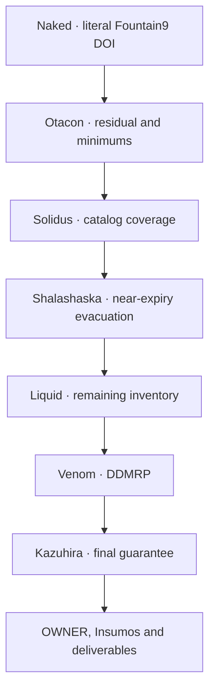
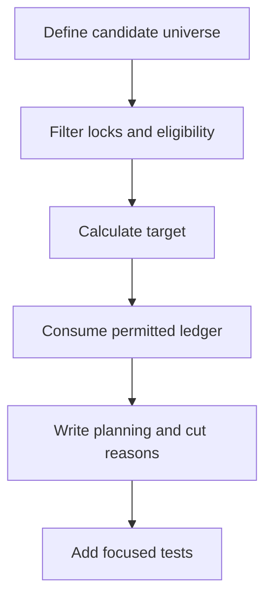
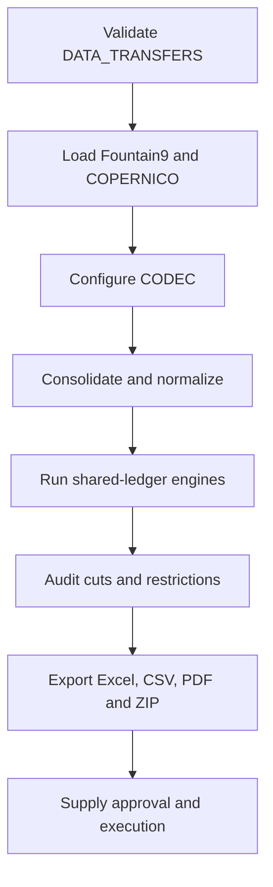

# MOTHER BASE

**Command center for planning replenishment transfers between distribution centers and stores.**

Build: `2026-10-07 · naked-otacon-v2`.

This document describes the current implementation, including the **Naked → Otacon → Solidus → Shalashaska → Liquid → Venom → Kazuhira → OWNER / Insumos** pipeline and the standard Otacon engine card.

## Purpose

MOTHER BASE turns Fountain9 recommendations, catalog data, inventory, store capacity and operational restrictions into an auditable transfer plan. Fountain9 proposes demand; MOTHER BASE decides whether that proposal is executable with the resources and rules available in the run.

The system must always answer:

- What transfers should be created?
- Which engine and coverage generated each line?
- What stock, capacity and task budget were consumed?
- Why was a case partially covered or rejected?
- Which source files and parameters produced the result?

A recommendation is never sufficient by itself. Stock, route, capacity, task budget, schedules, locks and ownership rules can reduce or reject it.

## Quick mental model

1. Validate the source data.
2. Consolidate Fountain9 demand and DOI instructions.
3. Build candidates with catalog, inventory and operational context.
4. Run engines in a fixed order against a shared resource ledger.
5. Record every assignment, partial cut and rejection reason.
6. Export operational files and management reports.
7. Review the audit before execution.

## Pipeline


```mermaid
flowchart TD
    A["Naked · literal Fountain9 DOI"] --> B["Otacon · residual and minimums"]
    B --> C["Solidus · catalog coverage"]
    C --> D["Shalashaska · near-expiry evacuation"]
    D --> E["Liquid · remaining inventory"]
    E --> F["Venom · DDMRP"]
    F --> G["Kazuhira · final guarantee"]
    G --> H["OWNER, Insumos and deliverables"]
```

The order is deliberate. Every assignment changes the shared stock, capacity and task ledgers. Reordering engines changes the result.

## Architecture

| Layer | Main files | Responsibility |
|---|---|---|
| Entry and session | `app.py`, `auth.py` | Streamlit entry point, navigation, authentication and profiles. |
| Orchestration | `modules/les_enfants_terribles.py` | Input validation, CODEC configuration, engine order, reports and downloads. |
| Domain | `modelo_abasto.py`, `engines/*.py` | Normalization, candidates, resource ledger, assignment and restrictions. |
| Presentation | `mother_base_theme.py` | Visual system, standard engine cards and UI components. |
| Validation | `tests/` | Business rules, engine contracts, UI labels and end-to-end checks. |

The decision path is:

```
source → normalization → candidate → filters → ledger → assignment → reason → export
```

Business rules belong in the domain layer. Streamlit should orchestrate and display results, not silently implement allocation rules.

## Engines

### Naked Engine

Runs the literal Fountain9 DOI recommendation from the exact source Fountain9 specified. It does not apply Otacon minimums or silently change the DOI source. It can produce partial assignments when stock, capacity or tasks are insufficient.

Required Fountain9 concepts include `Allocation (DOI Based)` and `Source Id Before Multi Source`.

### Otacon Engine

Otacon is the residual engine immediately after Naked. It covers what Naked did not execute, using the configured origins and the maximum valid MOV and minimum rules.

Otacon may:

- Recover residual demand after the Naked pass.
- Raise small positive recommendations to the configured minimum.
- Use configured additional MOV columns.
- Cover forecast and destination stock edge cases when the rule is enabled.
- Reassign the residual to another permitted origin when stock exists there.

Otacon must still respect stock, capacity, task budget, locks, routes, schedules, owner limits and all other master restrictions. A reassigned origin is the effective source of that transfer; it must never be reported as the original Fountain9 DOI source.

Otacon uses the same standard action card component as every other engine. Its configuration controls remain below the card.

### Solidus Engine

Applies catalog coverage rules such as AVL, preventive coverage, Golden/Infaltable/Anchor/KVI reinforcement and coverage without a usable Fountain9 recommendation.

### Shalashaska Engine

Evacuates inventory that is approaching expiry. It prioritizes destinations and routes that are already active and respects usable stock, destination capacity and task limits.

### Liquid Engine

Distributes eligible remaining inventory to stores that already have an active transfer route in the run. It uses catalog demand and DOH logic and reports why a candidate could not be used.

### Venom Engine

Runs DDMRP coverage at the end of the normal planning sequence. It calculates buffer zones and replenishes toward Top of Green. Venom keeps its assignments separately auditable.

### Kazuhira Engine

Kazuhira is the final safety net. It can cover remaining catalog breaks when the required stock and routes exist. It is disabled by default and may use an explicit Big Boss bypass for task or capacity rules only where the configured policy permits it.

### OWNER and Insumos

OWNER separates 425/856 stock by owner. Insumos adds eligible supplies to the appropriate bulk and consumes stock according to its own MOQ, origin and eligibility rules.

## Data sources and lineage

| Source | Type | Purpose | Required controls |
|---|---|---|---|
| `DATA_TRANSFERS` | Google Sheet / export | Stores, products, stock, capacity, owners, locks, routes and priorities. | Sheets, headers, types, duplicate keys and freshness. |
| Fountain9 | CSV files | DOI, MOV, demand, opening inventory and source recommendation. | Headers, numeric types, store-SKU keys, source IDs and exact file set. |
| COPERNICO | CSV/XLSX | Non-pickable inventory, rack status and 856 conditions. | Required for configured origins that depend on it; never increases stock. |
| `SCHEDULE` | Configuration sheet | Permitted origin-destination days. | Valid dates, origins and destinations. |
| SWA | Parameters/catalog | Sales opportunity prioritization. | Missing values, units and scope. |
| OWNER | Sheet/catalog | Owner-specific 425/856 inventory. | Owner-level stock cannot exceed adjusted stock. |

The functional demand key is **destination-SKU**. The physical stock key is **origin-SKU**. A transfer must retain the effective source, destination, SKU, engine, coverage, planning reason and cut reason when applicable.

The exact Fountain9 and COPERNICO files used in a run must be recorded. Repeated DOI instructions are summed only where the source contract explicitly allows it. Rows rejected during validation remain visible through a diagnostic reason.

## Master rules

### Usable stock

```
adjusted stock = floor(max(final available stock
                            - unavailable stock
                            - non-pickable COPERNICO stock,
                            0))
```

Then apply rack exclusions, excluded SKUs and owner limits. Incoming stock does not participate in base planning; it is available only in explicitly configured break-coverage rules.

### Capacity

```
line m³ = units × unit m³
maximum units = floor(remaining store m³ / unit m³)
```

Capacity accumulates by destination across the engines unless an explicitly separate engine ledger is documented.

### Shared tasks

Naked, Otacon, Solidus, Shalashaska and Liquid share `MAX_TASKS`. An engine cannot create resources by activating it. Kazuhira bypasses shared limits only when Big Boss explicitly enables the corresponding policy.

### Restrictions

Locks, closed stores, regional restrictions, route cost rules, rack status, schedules, owner availability and capacity always win over a recommendation.

## Inputs and execution

### Local installation

Requirements:

- Python 3.12.
- Access to `DATA_TRANSFERS`.
- Streamlit secrets configured outside Git.

```bash
pip install -r requirements.txt
streamlit run app.py
```

For reproducible development:

```powershell
python -m venv .venv
.\.venv\Scripts\python.exe -m pip install -r requirements-dev.lock
.\.venv\Scripts\python.exe -m pytest -q
```

### Secrets

Copy the example file locally and fill it with real values:

```bash
cp .streamlit/secrets.toml.example .streamlit/secrets.toml
```

Typical values:

```toml
BIG_BOSS_PASSWORD = "use-a-strong-unique-secret"
DATA_TRANSFERS_SPREADSHEET_ID = "spreadsheet-id"
DATA_DASHBOARD_SPREADSHEET_ID = "dashboard-id"
```

Never commit `.streamlit/secrets.toml`. If a secret was exposed, rotate it and remove it from repository history.

### Operational runbook

1. Validate `DATA_TRANSFERS` and source freshness.
2. Load only the Fountain9 files belonging to the run.
3. Load COPERNICO when required by the selected origins.
4. Configure origins, task limit, capacity policy, locks and engine toggles in CODEC.
5. Confirm Naked and Otacon settings.
6. Run the plan.
7. Review engine totals, cuts, blocked cases, stock consumption and capacity.
8. Download Excel, CSV, PDF and ZIP outputs.
9. Reconcile the result against Fountain9 and approve the operational files.

## Outputs

| Output | Use |
|---|---|
| Planning Excel | Full review, assignment detail, cuts, KPIs and diagnostics. |
| Operational CSVs | Execution by origin and owner where required. |
| Fountain9 comparison | Literal DOI versus MOTHER BASE execution and residual recovery. |
| PDF | Executive summary. |
| ZIP | Consolidated delivery package. |

Every transfer row should preserve `ENGINE`, `COBERTURA`, effective origin, destination, SKU, units, volume and planning/cut reasons.

## Development contract

A new rule must document:

1. Source and required columns.
2. Position in the engine sequence.
3. Whether it consumes tasks.
4. Whether it consumes destination capacity.
5. Which stock ledger it consumes.
6. Which locks and schedules it respects.
7. How it appears in breakdowns and exports.
8. Its `PLANNING_REASON` and automated test.

Recommended engine pattern:


```mermaid
flowchart TD
    A["Define candidate universe"] --> B["Filter locks and eligibility"]
    B --> C["Calculate target"]
    C --> D["Consume permitted ledger"]
    D --> E["Write planning and cut reasons"]
    E --> F["Add focused tests"]
```

Keep `modelo_abasto.py` free of Streamlit UI. Keep outputs stable. If an output label changes, update the breakdown, exports and tests together.

## Validation and release

Minimum validation:

```bash
python -m compileall app.py auth.py modelo_abasto.py engines modules
python -m pytest -q
```

Also test:

- With and without COPERNICO.
- Origins 444, 425 and 856.
- Closed stores, routes, regional locks, rack inventory and schedules.
- Task and destination-capacity limits.
- Each engine enabled and disabled.
- Excel, CSV, PDF and ZIP exports.
- Residual recovery through Otacon when another permitted origin has usable stock.

Before production, replay at least three historical dates and reconcile:

1. Fountain9 natural DOI units and tasks.
2. Otacon residual and minimum coverage.
3. Other engine contributions.
4. Stock by origin-SKU.
5. Capacity by destination.
6. Locks, owners and cut reasons.
7. Differences against the previous build.

## Packaging

A release package must include application source, required configuration examples and documentation. It must exclude:

- `.venv/`, `.venv312/`, `.python/`
- `__pycache__/`, `.pytest_cache/`
- `.streamlit/secrets.toml`
- Local execution results and temporary exports
- Personal credentials and tokens

The build stamp is stored in `APP_BUILD` and should be updated for every intentional release.

## Access profiles

**Big Boss** has full configuration access and may enable simulation and Kazuhira policies.

**Raiden** is an operational profile with restricted engines and protected-city rules.

## Business problem and expected result

A Fountain9 recommendation is not automatically an executable transfer. MOTHER BASE must evaluate inventory, receiving capacity, commercial priority, routes, schedules, closed stores, product locks, task budget, owner stock and non-pickable inventory at the same time.

The expected result is a proposal that a Supply operator can review and execute:

| Business question | Where to answer it |
|---|---|
| What transfers should be created? | Operational CSVs and the planning workbook. |
| What was fully or partially covered? | Assignment detail, breakdown tables and KPIs. |
| Which engine created a line? | `ENGINE` and `COBERTURA` in `BASE_TRANSFERS`. |
| Why was a case not sent? | Cut tables and the row-level reason fields. |
| Which source inventory was used? | Assignment detail and origin analysis. |
| What changed versus Fountain9? | Fountain9 comparison and residual audit. |
| Are priority products still at risk? | Golden, Infaltable, Anchor, KVI and health checks. |

A silent gap is a defect. Every relevant store-SKU must be assigned, explicitly rejected with a reason, or classified as healthy/no need.

## Run lifecycle


```mermaid
flowchart TD
    A["Validate DATA_TRANSFERS"] --> B["Load Fountain9 and COPERNICO"]
    B --> C["Configure CODEC"]
    C --> D["Consolidate and normalize"]
    D --> E["Run shared-ledger engines"]
    E --> F["Audit cuts and restrictions"]
    F --> G["Export Excel, CSV, PDF and ZIP"]
    G --> H["Supply approval and execution"]
```

### 1. Source validation

The application checks required sheets, expected headers, freshness and duplicate keys. Validation errors must be corrected at the source or deliberately acknowledged; they must not be hidden by a UI fallback.

### 2. Demand consolidation

Fountain9 files are consolidated by destination-SKU. Repeated DOI instructions are summed by source-destination-SKU only when the source contract permits it. MOV-related columns retain their maximum where specified by the contract.

The run must use only the files belonging to that planning date. Mixing files from different runs changes the demand baseline and invalidates reconciliation.

### 3. Candidate construction

Each candidate is enriched with store city, store priority, commercial category, unit volume, current stock, receiving capacity, route restrictions, schedule and target quantity.

Commercial priority is:

```
Infaltable > Golden > Anchor > KVI > Regular
```

Within a category, DATA_TRANSFERS store priority is preserved. DOI, DOH and stable store-SKU ordering are used as deterministic tie breakers.

### 4. Assignment

Each candidate is evaluated against the current shared ledger. An assignment consumes the effective source stock, destination capacity and a task when the engine requires one. A partial assignment updates the ledger with the actual units, not the original requested quantity.

### 5. Audit and export

The result contains planned lines, unplanned demand, cuts, restriction diagnostics, engine totals, source usage and comparison data. Web tables may be capped for browser performance; downloads must retain the complete detail.

## Source contracts

### DATA_TRANSFERS

DATA_TRANSFERS is the operational catalog and configuration source. It provides the store, product, stock, capacity, ownership, lock, route, priority, schedule and parameter tables used by the run.

Before planning, validate:

- Required sheets exist.
- Headers match the accepted contract.
- Store, SKU, origin and owner identifiers have consistent types.
- Required keys are unique where uniqueness is expected.
- Capacity, priority and status values are valid.
- The source is fresh enough for the planning SLA.
- External imports such as IMPORTRANGE have no permission errors.

### Fountain9

Fountain9 files provide demand and recommendation signals. Naked requires the DOI allocation and the source identifier before multi-source logic. Otacon can use MOV and configured minimum rules even when a positive DOI is absent.

Fountain9 is the reference for literal demand execution. It is not the authority for available stock, route permission or receiving capacity; those are controlled by the operational catalog and ledgers.

### COPERNICO

COPERNICO supplies non-pickable and rack-related information. It is required when planning from the configured 444, 831 or 856 origins. COPERNICO can reduce usable inventory and qualify logistics conditions; it cannot create stock or override a lock.

### SCHEDULE

SCHEDULE controls permitted origin-destination days. When the frequency block is active, a pair outside its allowed schedule cannot receive a transfer. A missing pair is not automatically converted into a restriction unless the configured rule says so.

### SWA

SWA supplies sales-opportunity information used for prioritization and reporting. It must not silently alter the stock ledger or create an assignment without an engine rule.

### OWNER

OWNER separates stock by owner for 425 and 856. Owner stock is a ceiling inside adjusted stock. A missing or insufficient owner balance cuts the candidate; it never increases the origin's physical inventory.

## Data quality and normalization

The normalizer must:

- Treat identifiers as strings when leading zeroes are meaningful.
- Convert quantities, dates and volumes to validated types.
- Reject non-finite quantities.
- Normalize whitespace and known aliases at the boundary.
- Preserve original values needed for audit.
- Keep rejected rows and their reasons.
- Avoid silently inventing defaults when a mandatory field is missing.
- Record the exact input file names and validation timestamp.

The main keys are:

| Key | Meaning |
|---|---|
| destination-SKU | A store's need for a product. |
| origin-SKU | Physical inventory available at a source. |
| source-destination-SKU | A transfer instruction and its source route. |
| destination-owner-SKU | Owner-constrained inventory at 425/856. |

## Detailed engine behavior

### Naked

Naked answers: “How much of the Fountain9 recommendation can be executed literally?”

It starts from the DOI source, applies the normal ledgers and creates partial lines when necessary. It does not raise quantities to a minimum, use residual MOV logic or silently switch origin.

### Otacon

Otacon answers: “How much additional need can be covered after Naked?”

Its residual target is conceptually:

```
residual = max(target after configured minimum rules
               - units actually executed by Naked, 0)
```

Otacon evaluates configured origin alternatives. If a valid alternative has stock and the route, capacity, task and lock rules permit it, the transfer is created from that effective origin. The audit must preserve both the Fountain9 reference context and the actual source used.

Otacon controls include:

- Raising small positive recommendations to the configured minimum.
- Using additional MOV columns.
- Covering forecast and destination-stock zero cases.
- Covering Fountain9 residuals.
- Limiting maximum net transfer.
- Applying destination stock-below-demand thresholds.

All controls must be visible in CODEC, documented in their help text and reflected in the run parameters.

### Solidus

Solidus is catalog coverage, not residual DOI execution. It evaluates AVL, preventive targets, bucket reinforcement and coverage without usable Fountain9 demand. Its four coverage categories must remain separately attributable in reports.

### Shalashaska

Shalashaska uses the near-expiry universe. It prioritizes routes that are already active through Naked, Otacon or Solidus and respects the same restrictions. It must not create a route merely because stock is close to expiry.

### Liquid

Liquid uses eligible remaining inventory after earlier priorities. It requires an eligible demand signal and an active route. Its DOH calculation uses ADU and the configured fallback hierarchy. It must report no eligible destination, capacity, route, stock or task as a concrete reason.

### Venom

Venom calculates DDMRP zones from lead time, variability, factors, ADU, order cycle and configured thresholds. Venom's capacity and detail remain auditable as a separate contribution even when the final operational CSV consolidates equal origin-destination-SKU rows.

### Kazuhira

Kazuhira is disabled by default and available only under the configured Big Boss policy. It reviews the final catalog universe for remaining breaks and can use non-Fountain9 CEDIS stock where the route and policy allow it. It must never be treated as part of the natural Fountain9 result.

### OWNER and Insumos

After engine planning, the output is partitioned by owner when required. Insumos adds eligible supplies and respects its MOQ, stock, route, lock and schedule rules. Insumos does not consume the shared task budget, but it does consume 444 stock and must remain visible in the final audit.

## Restrictions and blocking rules

| Rule | Operational effect |
|---|---|
| Closed stores | No destination assignment. |
| Manual store exclusions | Temporary destination block for the run. |
| Blocked cities | Prevents assignment to configured cities. |
| Product locks | Excludes locked SKU or store-SKU combinations. |
| Route cost restrictions | Blocks the configured destination-SKU route. |
| Regional restrictions | Applies to configured products from CDMX to GDL/MTY. |
| Racked inventory | Racked 444 stock cannot be shipped. |
| Schedule | Blocks origin-destination pairs outside frequency. |
| Store capacity | Limits cumulative receiving volume. |
| Owner balance | Limits 425/856 owner-specific transfers. |
| COPERNICO non-pickable | Reduces usable stock. |
| FRUVER 811 rule | Removes configured FRUVER stock from 811. |

Master toggles are applied while catalogs are loaded so every engine sees the same restricted structures. Engines must not implement divergent versions of the same blocking rule.

## CODEC configuration

CODEC controls the run. Before pressing execute, Supply should confirm:

- Selected origins and origin-specific policies.
- Maximum task budget.
- Store capacity behavior.
- Closed-store and route-lock toggles.
- Schedule/frequency enforcement.
- COPERNICO and owner inputs.
- Naked enabled state.
- Otacon minimum, MOV and residual settings.
- Optional Solidus, Shalashaska, Liquid, Venom and Kazuhira settings.
- Whether the run is simulation or operational.

A configuration is part of the run evidence. Save or export it with the result whenever the process requires reproducibility.

## Reading the result

Review the result in this order:

1. **Build and input manifest:** confirm the code version and exact source files.
2. **Engine summary:** verify expected engines are active and totals are plausible.
3. **Fountain9 comparison:** separate literal Naked execution from Otacon residual recovery.
4. **Cuts:** group by stock, capacity, task, lock, route, schedule and owner.
5. **Origin consumption:** reconcile used stock against adjusted stock.
6. **Destination capacity:** verify cumulative m³.
7. **Priority health:** review Infaltable, Golden, Anchor and KVI.
8. **Operational files:** confirm origin and owner partitioning.
9. **Approval:** only then release files for execution.

## Output field semantics

The most important fields are:

| Field | Meaning |
|---|---|
| `ENGINE` | Engine that generated or owns the line. |
| `COBERTURA` | Business coverage category. |
| `PLANNING_REASON` | Machine-readable planning reason. |
| Effective origin | Source actually used by the transfer. |
| Fountain9 source | Original DOI/source context when available. |
| Requested units | Target before resource constraints. |
| Planned units | Actual assigned units. |
| Cut reason | Why requested units were not fully planned. |
| Volume | Units multiplied by product volume. |
| Owner | Owner partition for applicable origins. |

## Daily operating checklist

### Before the run

- Confirm the planning date and business cycle.
- Confirm DATA_TRANSFERS freshness.
- Confirm all Fountain9 files belong to the same run.
- Confirm COPERNICO files for 444, 831 and 856 where required.
- Confirm owner and schedule information.
- Confirm new locks, closed stores and regional restrictions.
- Confirm maximum tasks and receiving capacity policy.
- Confirm Big Boss/Raiden profile.

### During the run

- Read validation warnings before executing.
- Check that Naked and Otacon are visible and configured.
- Confirm Otacon residual settings match the current business rule.
- Do not upload unrelated Fountain9 files to “complete” the data.
- Do not approve an output merely because total units look reasonable.

### After the run

- Check planned versus requested units.
- Check residual recovery by Otacon.
- Check all major cut reasons.
- Check stock and m³ reconciliation.
- Review priority health.
- Download and archive the exact outputs.
- Obtain Supply approval before operational execution.

## Deployment

### Streamlit Community Cloud

1. Push application source without secrets or local artifacts.
2. Create the Streamlit app from the production branch.
3. Set `app.py` as the main file.
4. Add secrets through the deployment settings.
5. Confirm Python/runtime and dependency lock.
6. Run a controlled test with representative files.
7. Review logs, source freshness and exports.
8. Promote only after reconciliation.

### Security

- Keep `.streamlit/secrets.toml` outside Git.
- Rotate any exposed credential immediately.
- Do not place service-account JSON, passwords or tokens in CSV, ZIP or README files.
- Use HTTPS and the platform's XSRF protections.
- Restrict access to DATA_TRANSFERS and dashboard sources.
- Treat generated operational files as sensitive business data.

## Testing strategy

The test suite covers pure business rules, contracts, engine attribution, UI labels and controlled end-to-end scenarios.

Minimum commands:

```bash
python -m compileall app.py auth.py modelo_abasto.py engines modules
python -m pytest -q
```

Focused validation for the current handoff:

```bash
python -m pytest tests/test_handoff_contract.py tests/test_naked_doi_otacon.py -q
```

Manual validation must include:

- Empty and partial Fountain9 recommendations.
- Residual recovery from a permitted alternate origin.
- No recovery when stock or route rules make the alternate unusable.
- Duplicate DOI instructions.
- 444, 425 and 856 owner behavior.
- COPERNICO reductions.
- Store capacity and task limits.
- Closed stores, schedules and regional restrictions.
- All exports and owner partitions.

A test is meaningful when it describes the input rule and expected business result, not merely that a function executed without an exception.

## Release process

For a release:

1. Update the build stamp.
2. Run compileall and the full test suite.
3. Replay representative historical dates.
4. Reconcile units, tasks, stock, capacity and cuts.
5. Review the README and release notes.
6. Package source without secrets, caches, virtual environments or local results.
7. Verify the ZIP can be opened and its contents are limited to the intended release.
8. Deploy to a controlled environment.
9. Obtain operational approval.
10. Tag the reconciled release for rollback.

## Troubleshooting

### Otacon is not visible

- Verify the running source contains the current `modules/les_enfants_terribles.py`.
- Verify `APP_BUILD`.
- Restart Streamlit after replacing source files.
- Clear the browser/session state.
- Confirm the UI renders `engine_otacon_card` through `render_action_card`.

### Otacon shows zero residual recovery

Inspect the run evidence in this order:

1. Was Naked enabled and did it consume the need?
2. Was Otacon enabled/configured for the relevant coverage?
3. Were alternate origins configured?
4. Did those origins have adjusted stock for the SKU?
5. Were routes, schedules, locks or regional rules blocking them?
6. Was destination capacity available?
7. Was the task budget already exhausted?
8. Did owner limits reduce the usable stock?
9. Is the reported source invalid only because it is not one of the configured Fountain9 origins?

Zero recovery can be a correct result when no permitted stock remains. The audit must distinguish “no eligible source” from “engine did not run.”

### Outputs do not match the UI

Confirm the build stamp, input manifest and session restart. A stale browser session or a different checkout can display an older engine order even when the repository was updated.

### Windows cannot open the ZIP

Regenerate the package outside the active source folder, exclude virtual environments and caches, wait for OneDrive synchronization to finish, then test the archive with a ZIP reader before delivery. Never include `.streamlit/secrets.toml`.

## Known limitations

- Big Boss uses a shared password rather than corporate SSO.
- Raiden is an operational profile without a separate password.
- Large CSV files are consolidated in memory.
- There is no persistent audit database for every run.
- Server date controls schedule evaluation.
- Historical delivery-date simulation is not available.
- Incoming inventory is not part of base planning.
- Multi-user concurrency and load testing need additional infrastructure.
- The Militaires Sans Frontières reporting module remains under development.

## Glossary

- **ADU:** Average Daily Usage.
- **AVL:** Available-to-list/catalog coverage rule.
- **CEDIS:** Distribution center.
- **COBERTURA:** Business coverage classification.
- **COPERNICO:** Inventory availability and non-pickable source.
- **DOH:** Days on Hand.
- **DOI:** Fountain9 allocation recommendation.
- **ENGINE:** Planning engine responsible for a line.
- **KVI:** Key Value Item.
- **Ledger:** Shared state of stock, capacity and tasks.
- **MOV:** Movement or sales signal.
- **MOQ:** Minimum Order Quantity.
- **OWNER:** Owner-specific stock partition.
- **PLANNING_REASON:** Machine-readable planning reason.
- **Residual:** Requirement left after a preceding engine.
- **SWA:** Sales opportunity analysis.
- **SKU:** Stock Keeping Unit.

