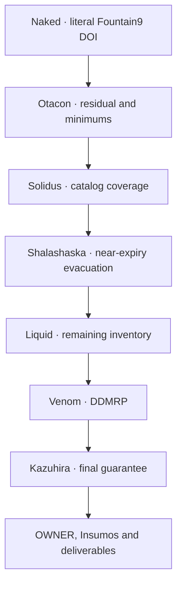
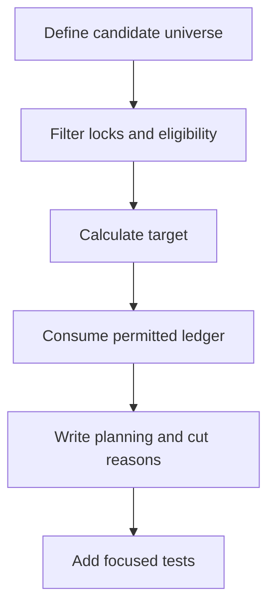

# MOTHER BASE

**Command center for planning replenishment transfers between distribution centers and stores.**

Build: `2026-10-07 · naked-otacon-v2`.

This document describes the current implementation, including the **Naked → Otacon → Solidus → Shalashaska → Liquid → Venom → Kazuhira → OWNER / Insumos** pipeline and the standard Otacon engine card.

## Purpose

MOTHER BASE turns Fountain9 recommendations, catalog data, inventory, store capacity and operational restrictions into an auditable transfer plan. Fountain9 proposes demand; MOTHER BASE decides whether that proposal is executable with the resources and rules available in the run.

The system must always answer:

- What transfers should be created?
- Which engine and coverage generated each line?
- What stock, capacity and task budget were consumed?
- Why was a case partially covered or rejected?
- Which source files and parameters produced the result?

A recommendation is never sufficient by itself. Stock, route, capacity, task budget, schedules, locks and ownership rules can reduce or reject it.

## Quick mental model

1. Validate the source data.
2. Consolidate Fountain9 demand and DOI instructions.
3. Build candidates with catalog, inventory and operational context.
4. Run engines in a fixed order against a shared resource ledger.
5. Record every assignment, partial cut and rejection reason.
6. Export operational files and management reports.
7. Review the audit before execution.

## Pipeline


```mermaid
flowchart TD
    A["Naked · literal Fountain9 DOI"] --> B["Otacon · residual and minimums"]
    B --> C["Solidus · catalog coverage"]
    C --> D["Shalashaska · near-expiry evacuation"]
    D --> E["Liquid · remaining inventory"]
    E --> F["Venom · DDMRP"]
    F --> G["Kazuhira · final guarantee"]
    G --> H["OWNER, Insumos and deliverables"]
```

The order is deliberate. Every assignment changes the shared stock, capacity and task ledgers. Reordering engines changes the result.

## Architecture

| Layer | Main files | Responsibility |
|---|---|---|
| Entry and session | `app.py`, `auth.py` | Streamlit entry point, navigation, authentication and profiles. |
| Orchestration | `modules/les_enfants_terribles.py` | Input validation, CODEC configuration, engine order, reports and downloads. |
| Domain | `modelo_abasto.py`, `engines/*.py` | Normalization, candidates, resource ledger, assignment and restrictions. |
| Presentation | `mother_base_theme.py` | Visual system, standard engine cards and UI components. |
| Validation | `tests/` | Business rules, engine contracts, UI labels and end-to-end checks. |

The decision path is:

```
source → normalization → candidate → filters → ledger → assignment → reason → export
```

Business rules belong in the domain layer. Streamlit should orchestrate and display results, not silently implement allocation rules.

## Engines

### Naked Engine

Runs the literal Fountain9 DOI recommendation from the exact source Fountain9 specified. It does not apply Otacon minimums or silently change the DOI source. It can produce partial assignments when stock, capacity or tasks are insufficient.

Required Fountain9 concepts include `Allocation (DOI Based)` and `Source Id Before Multi Source`.

### Otacon Engine

Otacon is the residual engine immediately after Naked. It covers what Naked did not execute, using the configured origins and the maximum valid MOV and minimum rules.

Otacon may:

- Recover residual demand after the Naked pass.
- Raise small positive recommendations to the configured minimum.
- Use configured additional MOV columns.
- Cover forecast and destination stock edge cases when the rule is enabled.
- Reassign the residual to another permitted origin when stock exists there.

Otacon must still respect stock, capacity, task budget, locks, routes, schedules, owner limits and all other master restrictions. A reassigned origin is the effective source of that transfer; it must never be reported as the original Fountain9 DOI source.

Otacon uses the same standard action card component as every other engine. Its configuration controls remain below the card.

### Solidus Engine

Applies catalog coverage rules such as AVL, preventive coverage, Golden/Infaltable/Anchor/KVI reinforcement and coverage without a usable Fountain9 recommendation.

### Shalashaska Engine

Evacuates inventory that is approaching expiry. It prioritizes destinations and routes that are already active and respects usable stock, destination capacity and task limits.

### Liquid Engine

Distributes eligible remaining inventory to stores that already have an active transfer route in the run. It uses catalog demand and DOH logic and reports why a candidate could not be used.

### Venom Engine

Runs DDMRP coverage at the end of the normal planning sequence. It calculates buffer zones and replenishes toward Top of Green. Venom keeps its assignments separately auditable.

### Kazuhira Engine

Kazuhira is the final safety net. It can cover remaining catalog breaks when the required stock and routes exist. It is disabled by default and may use an explicit Big Boss bypass for task or capacity rules only where the configured policy permits it.

### OWNER and Insumos

OWNER separates 425/856 stock by owner. Insumos adds eligible supplies to the appropriate bulk and consumes stock according to its own MOQ, origin and eligibility rules.

## Data sources and lineage

| Source | Type | Purpose | Required controls |
|---|---|---|---|
| `DATA_TRANSFERS` | Google Sheet / export | Stores, products, stock, capacity, owners, locks, routes and priorities. | Sheets, headers, types, duplicate keys and freshness. |
| Fountain9 | CSV files | DOI, MOV, demand, opening inventory and source recommendation. | Headers, numeric types, store-SKU keys, source IDs and exact file set. |
| COPERNICO | CSV/XLSX | Non-pickable inventory, rack status and 856 conditions. | Required for configured origins that depend on it; never increases stock. |
| `SCHEDULE` | Configuration sheet | Permitted origin-destination days. | Valid dates, origins and destinations. |
| SWA | Parameters/catalog | Sales opportunity prioritization. | Missing values, units and scope. |
| OWNER | Sheet/catalog | Owner-specific 425/856 inventory. | Owner-level stock cannot exceed adjusted stock. |

The functional demand key is **destination-SKU**. The physical stock key is **origin-SKU**. A transfer must retain the effective source, destination, SKU, engine, coverage, planning reason and cut reason when applicable.

The exact Fountain9 and COPERNICO files used in a run must be recorded. Repeated DOI instructions are summed only where the source contract explicitly allows it. Rows rejected during validation remain visible through a diagnostic reason.

## Master rules

### Usable stock

```
adjusted stock = floor(max(final available stock
                            - unavailable stock
                            - non-pickable COPERNICO stock,
                            0))
```

Then apply rack exclusions, excluded SKUs and owner limits. Incoming stock does not participate in base planning; it is available only in explicitly configured break-coverage rules.

### Capacity

```
line m³ = units × unit m³
maximum units = floor(remaining store m³ / unit m³)
```

Capacity accumulates by destination across the engines unless an explicitly separate engine ledger is documented.

### Shared tasks

Naked, Otacon, Solidus, Shalashaska and Liquid share `MAX_TASKS`. An engine cannot create resources by activating it. Kazuhira bypasses shared limits only when Big Boss explicitly enables the corresponding policy.

### Restrictions

Locks, closed stores, regional restrictions, route cost rules, rack status, schedules, owner availability and capacity always win over a recommendation.

## Inputs and execution

### Local installation

Requirements:

- Python 3.12.
- Access to `DATA_TRANSFERS`.
- Streamlit secrets configured outside Git.

```bash
pip install -r requirements.txt
streamlit run app.py
```

For reproducible development:

```powershell
python -m venv .venv
.\.venv\Scripts\python.exe -m pip install -r requirements-dev.lock
.\.venv\Scripts\python.exe -m pytest -q
```

### Secrets

Copy the example file locally and fill it with real values:

```bash
cp .streamlit/secrets.toml.example .streamlit/secrets.toml
```

Typical values:

```toml
BIG_BOSS_PASSWORD = "use-a-strong-unique-secret"
DATA_TRANSFERS_SPREADSHEET_ID = "spreadsheet-id"
DATA_DASHBOARD_SPREADSHEET_ID = "dashboard-id"
```

Never commit `.streamlit/secrets.toml`. If a secret was exposed, rotate it and remove it from repository history.

### Operational runbook

1. Validate `DATA_TRANSFERS` and source freshness.
2. Load only the Fountain9 files belonging to the run.
3. Load COPERNICO when required by the selected origins.
4. Configure origins, task limit, capacity policy, locks and engine toggles in CODEC.
5. Confirm Naked and Otacon settings.
6. Run the plan.
7. Review engine totals, cuts, blocked cases, stock consumption and capacity.
8. Download Excel, CSV, PDF and ZIP outputs.
9. Reconcile the result against Fountain9 and approve the operational files.

## Outputs

| Output | Use |
|---|---|
| Planning Excel | Full review, assignment detail, cuts, KPIs and diagnostics. |
| Operational CSVs | Execution by origin and owner where required. |
| Fountain9 comparison | Literal DOI versus MOTHER BASE execution and residual recovery. |
| PDF | Executive summary. |
| ZIP | Consolidated delivery package. |

Every transfer row should preserve `ENGINE`, `COBERTURA`, effective origin, destination, SKU, units, volume and planning/cut reasons.

## Development contract

A new rule must document:

1. Source and required columns.
2. Position in the engine sequence.
3. Whether it consumes tasks.
4. Whether it consumes destination capacity.
5. Which stock ledger it consumes.
6. Which locks and schedules it respects.
7. How it appears in breakdowns and exports.
8. Its `PLANNING_REASON` and automated test.

Recommended engine pattern:


```mermaid
flowchart TD
    A["Define candidate universe"] --> B["Filter locks and eligibility"]
    B --> C["Calculate target"]
    C --> D["Consume permitted ledger"]
    D --> E["Write planning and cut reasons"]
    E --> F["Add focused tests"]
```

Keep `modelo_abasto.py` free of Streamlit UI. Keep outputs stable. If an output label changes, update the breakdown, exports and tests together.

## Validation and release

Minimum validation:

```bash
python -m compileall app.py auth.py modelo_abasto.py engines modules
python -m pytest -q
```

Also test:

- With and without COPERNICO.
- Origins 444, 425 and 856.
- Closed stores, routes, regional locks, rack inventory and schedules.
- Task and destination-capacity limits.
- Each engine enabled and disabled.
- Excel, CSV, PDF and ZIP exports.
- Residual recovery through Otacon when another permitted origin has usable stock.

Before production, replay at least three historical dates and reconcile:

1. Fountain9 natural DOI units and tasks.
2. Otacon residual and minimum coverage.
3. Other engine contributions.
4. Stock by origin-SKU.
5. Capacity by destination.
6. Locks, owners and cut reasons.
7. Differences against the previous build.

## Packaging

A release package must include application source, required configuration examples and documentation. It must exclude:

- `.venv/`, `.venv312/`, `.python/`
- `__pycache__/`, `.pytest_cache/`
- `.streamlit/secrets.toml`
- Local execution results and temporary exports
- Personal credentials and tokens

The build stamp is stored in `APP_BUILD` and should be updated for every intentional release.

## Access profiles

**Big Boss** has full configuration access and may enable simulation and Kazuhira policies.

**Raiden** is an operational profile with restricted engines and protected-city rules.

## Known limitations

- Big Boss currently uses a shared password rather than corporate SSO.
- The application keeps large CSV consolidations in memory.
- There is no persistent audit store for every run's inputs and parameters.
- Server date controls schedule evaluation; historical delivery dates are not simulated.
- `STOCK.INCOMING` is not part of base planning.
- Multi-user concurrency and load testing require additional infrastructure.

## Production checklist

- [ ] Python and locked dependencies are installed.
- [ ] Secrets are configured outside Git.
- [ ] Required data sheets are available and fresh.
- [ ] COPERNICO is loaded for dependent origins.
- [ ] OWNER stock is available for 425/856.
- [ ] No assignment exceeds adjusted stock.
- [ ] No destination exceeds capacity.
- [ ] Task limits are respected.
- [ ] Closed stores and locks are absent from operational CSVs.
- [ ] Fountain9 versus MOTHER BASE differences are reviewed.
- [ ] The release ZIP contains no secrets, caches or virtual environments.

## Support and troubleshooting

If Otacon is missing from the UI, verify:

1. The running copy contains the current `modules/les_enfants_terribles.py`.
2. `APP_BUILD` matches the expected build.
3. The app was restarted after replacing the file.
4. The browser is not displaying a cached old session.
5. The current source uses `render_action_card` with key `engine_otacon_card`.

If residual recovery is zero, inspect usable stock, source-origin configuration, route locks, schedules, destination capacity, task budget and owner limits before treating it as a code defect.

## Glossary

- **DOI:** Fountain9 allocation recommendation.
- **MOV:** Movement or sales signal used by residual and coverage rules.
- **Residual:** Need left after the preceding engine.
- **Ledger:** Shared state of stock, capacity and tasks.
- **COVERAGE:** Business coverage category attached to an assignment.
- **PLANNING_REASON:** Machine-readable explanation for why a line was planned.
- **Cut reason:** Explanation for a partial or rejected assignment.
- **SWA:** Sales opportunity analysis.
- **ADU:** Average daily usage.
- **DOH:** Days on hand.
- **MOQ:** Minimum order quantity.
- **CEDIS:** Distribution center.

