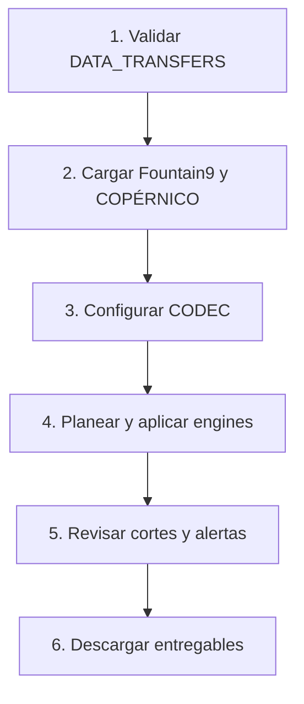
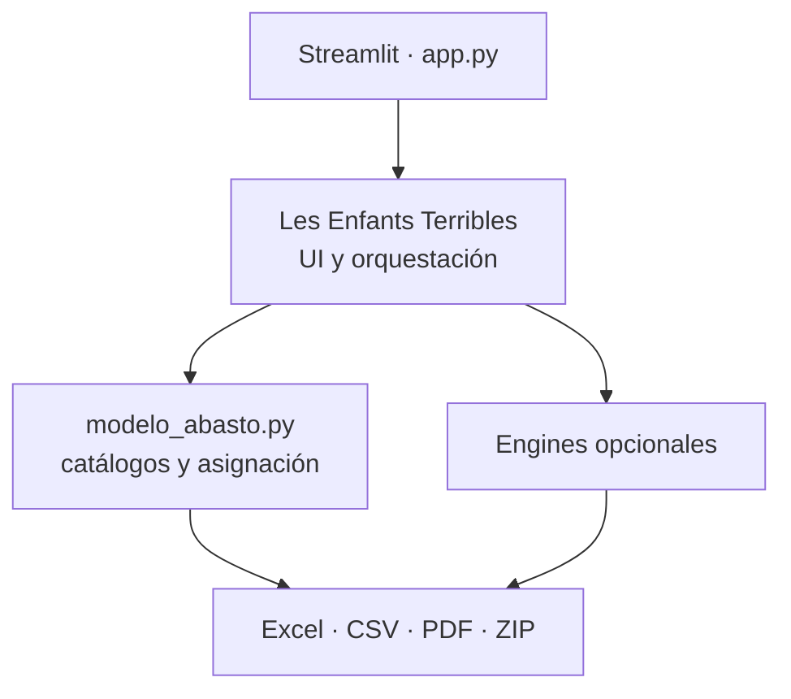
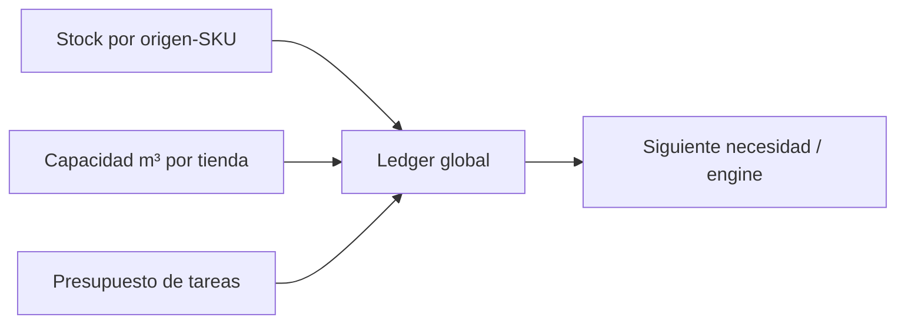
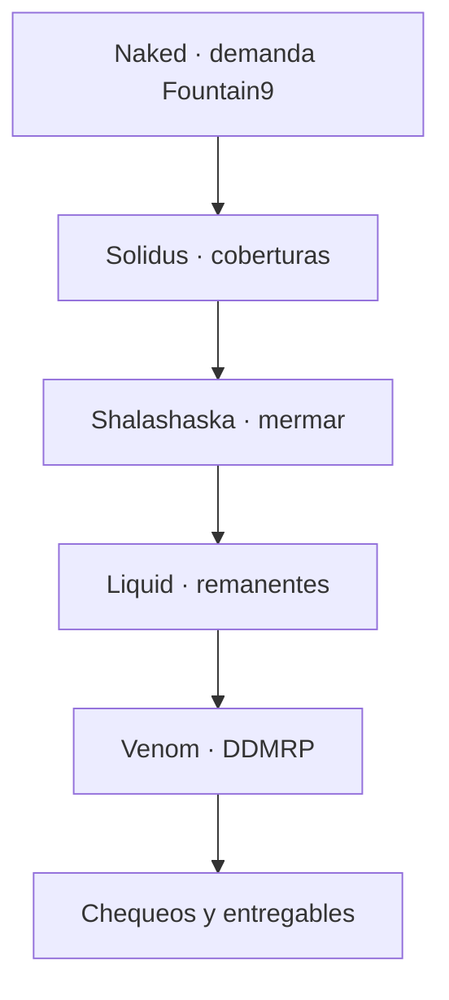
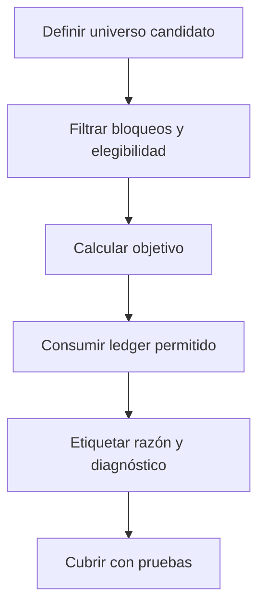

# MOTHER BASE

**Centro de comando para planear transferencias de abasto entre CEDIS y tiendas.**

Mother Base toma la recomendación diaria de Fountain9, la contrasta con el inventario y las restricciones operativas vigentes, y produce una propuesta de transferencias lista para revisar y ejecutar. Su objetivo no es reemplazar al criterio operativo: es volverlo consistente, trazable y repetible.

La aplicación está construida en Streamlit y utiliza un motor de planeación propio. Los resultados se descargan como Excel, CSV operativos, PDF ejecutivo y ZIP consolidado.

> **Audiencia de este documento**
>
> - **Supply / Operaciones:** qué resuelve el sistema, qué debe cargar y cómo interpretar el resultado.
> - **Analítica / Planeación:** prioridad, restricciones, capacidad y lógica de los engines.
> - **Desarrollo:** arquitectura, contratos de datos, puntos de extensión y validación antes de liberar.

---

## Contenido

1. [Qué problema resuelve](#qué-problema-resuelve)
2. [Qué hace una corrida](#qué-hace-una-corrida)
3. [Conceptos clave](#conceptos-clave)
4. [Arquitectura técnica](#arquitectura-técnica)
5. [Flujo de planeación](#flujo-de-planeación)
6. [Fuentes de datos](#fuentes-de-datos)
7. [Reglas mandantes](#reglas-mandantes)
8. [Engines de planeación](#engines-de-planeación)
9. [Restricciones y bloqueos](#restricciones-y-bloqueos)
10. [Perfiles de acceso](#perfiles-de-acceso)
11. [Resultados y cómo leerlos](#resultados-y-cómo-leerlos)
12. [Operación diaria](#operación-diaria)
13. [Instalación y despliegue](#instalación-y-despliegue)
14. [Guía de desarrollo](#guía-de-desarrollo)
15. [Pruebas y liberaciones](#pruebas-y-liberaciones)
16. [Limitaciones conocidas](#limitaciones-conocidas)

---

## Qué problema resuelve

En una operación de abasto, una recomendación de demanda por sí sola no basta para crear una transferencia ejecutable. Antes de decidir qué enviar hay que considerar, al mismo tiempo:

- Stock realmente utilizable en cada origen.
- Capacidad de recibo de cada tienda.
- Prioridad comercial de producto y tienda.
- Máximo de tareas que la operación puede ejecutar.
- Tiendas cerradas, rutas no permitidas, bloqueos regionales y frecuencia de envío.
- Inventario no pickeable detectado por COPÉRNICO.
- Inventario con owner específico en los orígenes 425 y 856.

Mother Base reúne estas condiciones en una sola corrida. Primero atiende la necesidad natural de Fountain9 y, si se activan, ejecuta mecanismos de cobertura, evacuación o liquidación usando únicamente el stock, capacidad y tareas que sigan disponibles.

### Resultado esperado

| Pregunta | Dónde se responde |
|---|---|
| ¿Qué transferencias se deben crear? | CSV por origen / owner y Excel consolidado |
| ¿Qué se cubrió totalmente o parcialmente? | `DETALLE_ASIGNACION`, breakdown y KPIs |
| ¿Por qué no se envió un caso? | `BASE_TRANSFERS` y tabla de cortes |
| ¿Qué inventario del origen se utilizó? | Detalle de asignación y análisis por origen |
| ¿Qué cambió frente a Fountain9? | Reporte comparativo Fountain9 vs Mother Base |
| ¿Hay productos prioritarios todavía en riesgo? | Check de salud Golden / Infaltable / Anchor |

---

## Qué hace una corrida


```mermaid
flowchart TD
    A["1. Validar DATA_TRANSFERS"] --> B["2. Cargar Fountain9 y COPÉRNICO"]
    B --> C["3. Configurar CODEC"]
    C --> D["4. Planear y aplicar engines"]
    D --> E["5. Revisar cortes y alertas"]
    E --> F["6. Descargar entregables"]
```

1. El usuario entra a **Les Enfants Terribles** y el sistema obtiene `DATA_TRANSFERS`.
2. Se valida que las fuentes y hojas requeridas estén disponibles y con una frescura aceptable.
3. Se cargan uno o varios CSV de Fountain9. Opcionalmente se agregan los archivos de COPÉRNICO.
4. Supply define orígenes, máximo de tareas, bloqueos temporales y engines activos en el panel **CODEC**.
5. El motor consolida las necesidades por tienda–SKU y asigna respetando todas las restricciones.
6. Se generan diagnósticos, KPIs y archivos de salida.

La aplicación pide una confirmación explícita antes de ejecutar. Esa confirmación es parte del control operativo: confirma que se validó la capacidad de recibo y que se consideraron tiendas en resguardo.

---

## Conceptos clave

| Término | Significado operativo |
|---|---|
| **Origen** | CEDIS o bodega desde la cual se envía inventario. |
| **Destino** | Tienda que recibirá producto. |
| **SKU** | Producto identificado por `RETAIL_ID` / `PRODUCT_ID`. |
| **Tarea** | Una combinación única `origen + destino + SKU`. Una misma línea puede contener muchas unidades. |
| **ROQ / MOV** | Recomendación natural conservada desde Fountain9. |
| **ADU** | Venta diaria promedio (`Average Daily Units`). |
| **DOH** | Días de inventario: inventario disponible entre ADU. |
| **AVL** | Cobertura para productos que están en stockout de catálogo. |
| **MOQ** | Múltiplo mínimo de envío. |
| **OWNER** | Separación de inventario y archivos para 425 y 856. |
| **COPÉRNICO** | Fuente que identifica inventario no utilizable o condiciones de ubicación. |
| **CODEC** | Panel de parámetros de una corrida. |

---

## Arquitectura técnica


```mermaid
flowchart TD
    UI["Streamlit · app.py"] --> ORQ["Les Enfants Terribles\nUI y orquestación"]
    ORQ --> CORE["modelo_abasto.py\ncatálogos y asignación"]
    ORQ --> EXT["Engines opcionales"]
    CORE --> OUT["Excel · CSV · PDF · ZIP"]
    EXT --> OUT
```

### Componentes principales

| Ruta | Responsabilidad |
|---|---|
| `app.py` | Entrada Streamlit, navegación y selección de módulo. |
| `auth.py` | Estado de sesión y perfiles Big Boss / Raiden. |
| `modules/les_enfants_terribles.py` | Pantallas de planeación, validación de inputs, orquestación, análisis y descargas. |
| `modelo_abasto.py` | Motor puro: carga catálogos, consolida Fountain9, calcula objetivos, asigna stock y escribe entregables. |
| `engines/mission_control.py` | Selecciona la cola base Naked / hardcodes. |
| `engines/naked_engine.py` | Clasifica la recomendación natural y los casos sin recomendación. |
| `engines/solidus_engine.py` | Clasifica protecciones manuales de la cola base. |
| `engines/shalashaska_engine.py` | Evacuación de producto por mermar. |
| `engines/liquid_engine.py` | Liquidación de remanente. |
| `engines/venom_engine.py` | Cobertura DDMRP posterior a la planeación. |
| `modules/militaires_sans_frontieres.py` | Reporting histórico y ejecutivo; módulo en evolución. |
| `mother_base_theme.py` | Sistema visual de la aplicación. |
| `tests/` | Pruebas de reglas de negocio y contratos críticos. |

### Principio de diseño del motor

El motor es secuencial a propósito. Cada asignación modifica tres recursos compartidos:


```mermaid
flowchart LR
    A["Stock por origen-SKU"] --> D["Ledger global"]
    B["Capacidad m³ por tienda"] --> D
    C["Presupuesto de tareas"] --> D
    D --> E["Siguiente necesidad / engine"]
```

Por esta razón no se debe paralelizar la fase de asignación sin rediseñar el ledger. El orden de prioridades no es decorativo: cambia el resultado.

---

## Flujo de planeación

### 1. Consolidación de la demanda

Los CSV de Fountain9 se consolidan por destino–SKU. Para valores de recomendación repetidos se conserva el máximo cuando corresponde, evitando inflar la demanda por archivos o filas duplicadas.

### 2. Construcción de candidatos

Cada fila se enriquece con ciudad, prioridad de tienda, categoría comercial, volumen, stock actual, capacidad, restricciones y objetivo de envío. La jerarquía comercial es:

1. Infaltable
2. Golden
3. Anchor
4. KVI
5. Regular

Dentro de la misma categoría se atiende primero la recomendación natural, luego protecciones manuales, prioridad de tienda, stockout, destino, SKU y orden de entrada.

### 3. Asignación base

Para cada necesidad, el sistema intenta cubrir la cantidad objetivo con los orígenes seleccionados en CODEC. El orden de esos orígenes define la prioridad de consumo de stock.

Cuando hay stock limitado, el motor protege el aprovechamiento del inventario con dos pasadas:

1. Intenta cubrir solicitudes completas y difiere las que no caben.
2. Atiende solicitudes posteriores más pequeñas y después usa el remanente para cubrir parcialmente lo diferido.

Ejemplo: si quedan 4 unidades y las solicitudes son 10, 1 y 1, primero se cubren las dos solicitudes de 1 y las 2 unidades restantes se asignan al caso de 10.

### 4. Engines posteriores

Los engines opcionales se ejecutan sobre lo que quedó del ledger. Nunca deben inventar capacidad, tareas o stock.

### 5. Salida y diagnóstico

Las líneas planeadas, los cortes y las causas se escriben en los archivos de salida. Las tablas web limitan la visualización para proteger rendimiento, pero permiten descargar el detalle completo.

---

## Fuentes de datos

### DATA_TRANSFERS

`DATA_TRANSFERS` es la fuente de configuración y catálogo. Se descarga desde Google Sheets y se valida al iniciar o al presionar **Volver a validar la base**. La sesión conserva la versión validada en caché.

Entre otras, la base contiene contratos para tiendas, stock, capacidad, productos, bloqueos, owners, horarios y prioridades. Las hojas obligatorias deben existir con sus encabezados acordados.

### Fountain9

Se carga como uno o varios CSV. Aporta la necesidad natural, variables de demanda e inventario y, cuando existe, la decisión final de asignación de Fountain9 mediante `Allocation (Store Based)`.

La columna `Allocation (Store Based)` permite construir el reporte comparativo. Si no está presente, el reporte se omite; la planeación no se bloquea.

### COPÉRNICO

COPÉRNICO es opcional para la aplicación en general, pero es obligatorio cuando se planea desde los orígenes 444, 831 o 856. No sustituye a STOCK: descuenta inventario no pickeable y ayuda a determinar condiciones del 856.

### SCHEDULE

La hoja `SCHEDULE` define días permitidos para una pareja origen–destino. Su bloqueo está apagado por defecto. Si se activa, la validación se hace contra la fecha real de la corrida en la zona horaria de Ciudad de México.

### SWA

Hoja Aleph con `SWA_POTENTIAL_GAIN_COUNTRY` por tienda–SKU (Sales Weighted Availability — métrica clave de negocio), actualizada cada hora. Nunca participa en ninguna regla de asignación, solo en reportería — pero esa reportería ahora cubre todos los entregables principales.

**Ganado es binario, no proporcional.** Basta con sacar a una tienda-SKU del quiebre (cualquier unidad > 0 asignada) para capturar el `SWA_POTENTIAL_GAIN_COUNTRY` completo de esa fila — así es como se calcula el dato en origen (la condición de Aleph es `STOCK_UNITS > 0`, no una proporción). Ausente de la hoja SWA = 0 por descarte; nunca bloquea ningún reporte.

**Universo: todo quiebre del catálogo**, no solo lo que algún engine intentó cubrir — incluye tienda-SKU donde ni siquiera había stock en ningún origen para intentarlo. `build_swa_report()` en `modules/les_enfants_terribles.py` es el cálculo autoritativo: itera CATALOGO completo, identifica quiebres (`stock_base` = 0) y compara contra `build_assigned_totals_by_key()` (suma por destino-SKU a través de todos los engines, para no contar doble si dos engines tocan la misma combinación).

**Insumos es un caso especial.** Sus filas no viven en `result.allocation_rows` (corre aparte, anexado directo al CSV sin consumir tareas), así que `build_assigned_totals_by_key()` recibe sus llaves cubiertas por separado (`insumos_summary["assigned_keys"]`) para que el reporte central no las marque como "perdidas" por error. Su propio "SWA ganado" también se calcula aparte, directo desde sus filas ya enriquecidas — no está perfectamente reconciliado contra el reporte central si la misma tienda-SKU también recibió algo por la vía regular, pero ambos números son correctos por separado.

**Dónde aparece — cobertura completa de los entregables principales:**

- Sección dedicada al inicio de resultados (SWA ganado, SWA perdido/en riesgo, universo total, quiebres sin SWA registrado).
- `SWA_POTENTIAL_GAIN_COUNTRY` como columna en los CSV operativos, `BASE_TRANSFERS` y `DETALLE_ASIGNACION` (vía `enrich_rows_with_product_info`, mismo punto de enriquecimiento que `PRODUCT_NAME`/`CATEGORY_NAME`). Es informativo por fila — si la misma tienda-SKU recibe varias líneas, el valor se repite; no debe sumarse a través de filas sin deduplicar primero.
- `SWA_GANADO` por engine/causal en "Efectivamente planeado", `SWA_PERDIDO` por motivo en "Cortes", columna `SWA` en el Overview general (`ordered_breakdown_rows`), `SWA_INFORMATIVO` en "Sin recomendación" (ver nota abajo).
- Reporte de universo Golden/Infaltable/Anchor (detalle completo y micro-detalle de no cubiertos).
- **Cada una de las 9 secciones de REPORTE POR ENGINE** (Naked, AVL, Preventivo, Refuerzo, Cobertura sin Fountain9, Shalashaska, Liquid, Venom, Insumos) trae su propia tarjeta "SWA GANADO" — `swa_ganado_by_engine()` reusa lo ya calculado en `planned_by_engine_rows`, salvo Insumos que usa su cálculo propio.
- **Fountain9 vs Mother Base**: los tres bloques (cara a cara, adicional, total) ahora incluyen SWA — permite ver cuánto SWA capturamos que Fountain9 ni siquiera evalúa.
- **PDF ejecutivo**: tabla de breakdown con columna SWA, más un bloque resumen (ganado/perdido/universo) junto a la tabla ejecutiva principal.

**"Sin recomendación" es informativo, no "perdido".** Estas filas tienen `opening ≥ demanda` por definición (así decide Fountain9 no recomendar nada), así que normalmente no son rupturas reales contra nuestro propio `stock_base` — el campo se llama `SWA_INFORMATIVO` a propósito, para no confundirlo con una pérdida real. Si aparece algo distinto de cero, suele ser un desfase entre el opening predicho de Fountain9 y el stock actual.

---

## Reglas mandantes

Estas reglas no deben cambiarse sin una revisión conjunta de Supply y Desarrollo.

| Regla | Aplicación |
|---|---|
| **Stock es mandante** | Nunca se asignan más unidades que el stock final ajustado del origen. |
| **Capacidad es mandante** | Ninguna tienda puede superar su `CAP_RECIBO` acumulado en m³. |
| **Tareas compartidas** | Naked, Solidus, Shalashaska y Liquid comparten `MAX_TASKS`. |
| **Bloqueos explícitos** | Tiendas, ciudades, rutas, productos, restricciones regionales y frecuencia no pueden saltarse. |
| **Prioridad comercial** | Infaltable > Golden > Anchor > KVI > Regular. |
| **OWNER no crea stock** | En 425/856 se usa el menor entre stock ajustado y stock del owner. |
| **COPÉRNICO no crea stock** | Solo descuenta inventario no utilizable y aporta condición logística. |
| **INSUMOS no consume tareas** | Sí consume stock de 444 y respeta MOQ, elegibilidad y calendario. |

### Stock utilizable

```text
stock ajustado = floor(max(STOCK_DISPONIBLE_FINAL
                           - NO_DISPONIBLE
                           - COPERNICO_NO_USABLE,
                           0))
```

Después se aplican exclusiones específicas: rackeado de 444, SKUs excluidos y, para 425/856, el límite por OWNER. `STOCK.INCOMING` no participa en la planeación base; únicamente puede utilizarse en la cobertura de quiebres sin Fountain9.

### Capacidad

```text
m³ de línea = unidades × m³ por unidad
unidades máximas = floor(m³ restante de tienda / m³ por unidad)
```

La capacidad se acumula por destino durante toda la corrida.

---

## Engines de planeación

Los engines se aplican en una secuencia explícita. Activar uno no le otorga recursos adicionales: consume el mismo ledger cuando corresponde.


```mermaid
flowchart TD
    A["Naked · demanda Fountain9"] --> B["Solidus · coberturas"]
    B --> C["Shalashaska · mermar"]
    C --> D["Liquid · remanentes"]
    D --> E["Venom · DDMRP"]
    E --> F["Chequeos y entregables"]
```

### Naked Engine

Atiende la recomendación natural con ROQ positivo. Incluye un toggle independiente, **Cubrir a Fountain9**, para hardcodes en los que Fountain9 no produce ROQ positivo pero el negocio determina que debe haber una cobertura mínima:

- Inventario y demanda en cero: objetivo mínimo configurado.
- Inventario menor a demanda con ROQ no positivo: objetivo mínimo.
- Net transfer bajo y poco inventario en destino: mínimo de 3 unidades.

Estos casos pertenecen a Naked porque cubren una necesidad que Fountain9 no formuló como ROQ positivo; no deben confundirse con Solidus.

### Solidus Engine

Solidus utiliza stock, capacidad y tareas restantes en este orden:

1. **AVL:** cobertura de catálogo con stock final cero y sin servicio positivo previo.
2. **Prevención:** producto con poco inventario o menos de un DOH, sin recomendación positiva de Fountain9.
3. **Refuerzo Golden / Infaltable / Anchor:** lleva el inventario hacia un DOH objetivo específico cuando Fountain9 no solicitó el caso.
4. **Cobertura sin Fountain9:** opcional y apagada por defecto; cubre stockouts que ni siquiera tienen fila en el bulk de Fountain9.

Para resolver ADU, las coberturas usan esta cascada:

1. ADU de la tienda–SKU.
2. Promedio del mismo SKU en otras tiendas de la misma ciudad.
3. Sin ADU disponible: se aplica el tratamiento propio de cada cobertura.

El Refuerzo Golden / Infaltable / Anchor usa el universo definido en la hoja correspondiente, no solamente las filas existentes de catálogo. Nunca modifica una recomendación que Fountain9 ya solicitó.

### Shalashaska Engine

Propone evacuar inventario marcado como **por mermar**, respetando los bloqueos, la capacidad de las tiendas y el presupuesto compartido de tareas.

### Liquid Engine

Distribuye remanentes de inventario desde los orígenes seleccionados. Puede correr con SKUs indicados manualmente o detectar colas pequeñas según el umbral configurado. Si no encuentra destino elegible, reporta el motivo: restricción, capacidad, falta de tarea o ausencia de demanda apta.

### Venom Engine

Ejecuta al final como cobertura DDMRP. Calcula zonas de buffer y propone llenado hacia el `Top of Green` cuando corresponde. Sus líneas se conservan separadas de otras asignaciones aun cuando compartan origen, destino y SKU.

Venom no consume el ledger de capacidad usado por los engines anteriores ni se consolida con sus líneas. Esto debe mantenerse para que su impacto sea auditable.

### Checks posteriores

Al terminar la corrida, Mother Base revisa el universo Golden / Infaltable / Anchor. El check de salud es informativo: identifica tienda–SKU que quedaron debajo del objetivo de DOH después de todos los engines; no replantea automáticamente.

---

## Restricciones y bloqueos

| Restricción | Efecto |
|---|---|
| `TIENDAS_CERRADAS` | No permite envíos a destinos cerrados. Tiene toggle, activo por defecto. |
| Tiendas excluidas en CODEC | Bloqueo temporal de destinos para la corrida. |
| Ciudades bloqueadas | Bloqueo temporal de ciudades. Raiden no puede bloquear las ciudades protegidas. |
| `BLOQUEOS` + SKUs de CODEC | Excluyen producto de engines e INSUMOS. |
| `RUTA_COSTOS` | Bloquea una pareja destino–SKU. Tiene toggle activo por defecto. |
| `BLOQUEOS_FORANEAS` | Bloquea productos señalados desde CDMX hacia GDL/MTY. Tiene toggle activo por defecto. |
| `RACKEADOS` | El stock rackeado no puede salir desde 444. Tiene toggle activo por defecto. |
| `SCHEDULE` | Si está activado, bloquea origen–destino fuera de frecuencia. |
| FRUVER 811 | Toggle que retira el stock 811 sin alterar otros orígenes. |

La implementación de los toggles de reglas maestras limpia las estructuras afectadas al cargar los catálogos. Esto evita que cada engine tenga que implementar el mismo `if` y garantiza una aplicación uniforme.

### Regla regional

El bloqueo regional solo aplica si el SKU figura en `BLOQUEOS_FORANEAS`, el origen está en CDMX y el destino está en GDL o MTY. Una clasificación Golden, Infaltable, Anchor o KVI no crea ni elimina por sí misma un bloqueo regional.

---

## Perfiles de acceso

| Perfil | Alcance |
|---|---|
| **Big Boss** | Acceso completo. Puede configurar todos los engines y usar modo simulación. |
| **Raiden** | Perfil operativo. No activa Solidus ni Liquid, tiene otros orígenes predeterminados y no puede bloquear las seis ciudades protegidas. |

La autenticación de Big Boss se configura mediante `BIG_BOSS_PASSWORD` en Streamlit Secrets. No use valores de ejemplo en producción y nunca suba `secrets.toml` al repositorio.

---

## Resultados y cómo leerlos

### Entregables

| Archivo | Uso |
|---|---|
| Excel de planeación | Revisión completa, detalle de base, asignación, cortes y análisis. |
| CSV operativos | Carga o ejecución por origen; 425/856 se separan por owner cuando corresponde. |
| `Fountain9_Sin_Recomendacion_DD-MM-YYYY.csv` | Casos en que Fountain9 no recomendó y su explicación operativa. |
| PDF ejecutivo | Resumen para dirección. |
| ZIP | Paquete consolidado de toda la corrida. |

Los archivos son temporales dentro de la sesión. Descárgalos antes de cerrar o dejar expirar la sesión.

### Breakdown de resultados

La interfaz separa cuatro vistas para evitar mezclar causas diferentes:

1. **Efectivamente planeado:** líneas con unidades asignadas, por engine y causal.
2. **Cortes:** necesidades positivas que no recibieron unidades, agrupadas por restricción.
3. **Sin recomendación:** explicación de por qué Fountain9 no pidió producto; usa solo datos del bulk de Fountain9.
4. **Overview:** panorama general de los estados de la corrida.

`SIN RECOMENDACIÓN` no significa necesariamente que la demanda sea cero. Puede indicar que el inventario o transferencias entre tiendas ya cubrían la necesidad.

### Reporte Fountain9 vs Mother Base

Cuando existe `Allocation (Store Based)`, el reporte tiene tres bloques:

| Bloque | Pregunta que responde |
|---|---|
| Cara a cara | En los casos que Fountain9 evaluó, ¿qué cubrió cada sistema? |
| Mother Base adicional | ¿Qué atendió Mother Base que Fountain9 no evaluó? |
| Total Mother Base | ¿Cuál es el impacto completo de Mother Base? |

No se debe leer la comparación como una competencia de igualdad de condiciones: Mother Base incorpora mecanismos y universos que Fountain9 puede no tener en su archivo de entrada.

---

## Operación diaria

### Antes de ejecutar

1. Confirme que Aleph y las fuentes de `DATA_TRANSFERS` estén actualizadas.
2. Abra Mother Base y seleccione perfil.
3. Ingrese a **Les Enfants Terribles**.
4. Confirme que las tarjetas de salud estén verdes o investigue las alertas.
5. Cargue los CSV de Fountain9 correspondientes a la corrida.
6. Si usa 444, 831 o 856, cargue COPÉRNICO para cada origen requerido.
7. Revise capacidad de recibo, tiendas en resguardo y bloqueos temporales.

### Configuración en CODEC

1. Seleccione los orígenes en orden de consumo.
2. Defina el máximo de tareas.
3. Agregue bloqueos temporales de tiendas, ciudades o SKUs cuando aplique.
4. Configure INSUMOS, FRUVER y el calendario si corresponde.
5. Active únicamente los engines requeridos para la corrida.
6. Revise parámetros de objetivos y umbrales antes de confirmar.

### Después de ejecutar

1. Compare tareas utilizadas contra el máximo.
2. Revise unidades, m³ y consumo por origen.
3. Lea los cortes y sus motivos antes de entregar el bulk.
4. Revise el check Golden / Infaltable / Anchor.
5. Valide la separación por owner de 425 y 856.
6. Descargue Excel, CSV, PDF y ZIP.

---

## Instalación y despliegue

### Requisitos

- Python 3.12.
- Acceso a la fuente `DATA_TRANSFERS`.
- Credenciales configuradas en Streamlit Secrets cuando aplique.

```bash
pip install -r requirements.txt
streamlit run app.py
```

Para desarrollo y pruebas:

```bash
pip install -r requirements-dev.txt
pytest -q
```

### Configuración local

Copie el ejemplo y rellene valores reales exclusivamente en su entorno local:

```bash
cp .streamlit/secrets.toml.example .streamlit/secrets.toml
```

Variables relevantes:

```toml
BIG_BOSS_PASSWORD = "un-secreto-fuerte-y-unico"
DATA_TRANSFERS_SPREADSHEET_ID = "id-del-sheet"
DATA_DASHBOARD_SPREADSHEET_ID = "id-del-dashboard"
```

> **Seguridad:** `.streamlit/secrets.toml` debe estar en `.gitignore`. Si un secreto llegó al repositorio, elimínelo del historial y rótelo antes de desplegar.

### Streamlit Community Cloud

1. Suba el proyecto a GitHub sin archivos secretos.
2. Cree una app y seleccione la rama de producción.
3. Configure `app.py` como main file.
4. Agregue secrets desde la configuración del deployment.
5. Revise logs, perfiles, fuentes y una corrida controlada antes de liberar a operación.

---

## Guía de desarrollo

### Contrato de una nueva regla

Toda regla nueva debe responder, como mínimo:

1. ¿Cuál es su fuente y qué columnas necesita?
2. ¿En qué posición de la secuencia corre?
3. ¿Consume tareas?
4. ¿Consume capacidad?
5. ¿De qué stock descuenta?
6. ¿Qué bloqueos debe respetar?
7. ¿Cómo aparecerá en breakdown, Excel, CSV y PDF?
8. ¿Cuál será su `PLANNING_REASON` y su prueba automatizada?

Una regla no puede elevar el inventario utilizable por encima de `STOCK_DISPONIBLE_FINAL` sin redefinir explícitamente el contrato de stock mandante.

### Patrón recomendado para un engine


```mermaid
flowchart TD
    A["Definir universo candidato"] --> B["Filtrar bloqueos y elegibilidad"]
    B --> C["Calcular objetivo"]
    C --> D["Consumir ledger permitido"]
    D --> E["Etiquetar razón y diagnóstico"]
    E --> F["Cubrir con pruebas"]
```

Los engines deben conservar la trazabilidad de cada decisión: motivo, cantidad objetivo, cantidad asignada, fuente de stock y causa de corte.

### Convenciones importantes

- `modelo_abasto.py` debe mantenerse libre de UI de Streamlit.
- La UI orquesta; el motor decide y devuelve estructuras comprobables.
- Las pruebas deben declarar la regla con un caso de entrada y resultado esperado, no solo validar que una función no falle.
- No modifique las etiquetas de salida sin actualizar el breakdown, los exports y pruebas relacionadas.
- No fusionar líneas de Venom con líneas del resto de engines.

---

## Pruebas y liberaciones

### Validación mínima antes de merge

```bash
python -m compileall app.py auth.py modelo_abasto.py engines modules
pytest -q
```

Además de la suite, pruebe manualmente:

- Con y sin COPÉRNICO.
- Orígenes 444, 425 y 856.
- Bloqueos regionales, rackeados, rutas y frecuencia.
- Límite de tareas y capacidad de tienda.
- Engines activados y desactivados.
- Excel, CSV, PDF y ZIP resultantes.

### Go-live y conciliación

Antes de confiar una liberación a operación, reprocesar al menos tres fechas históricas y conciliar:

1. Tareas y unidades naturales de Fountain9.
2. Manuales y coberturas por engine.
3. Consumo de stock por origen–SKU.
4. Capacidad utilizada por destino.
5. Bloqueos, rackeados, owners y cortes.
6. Diferencias contra la versión previa, clasificadas por regla.

### Estrategia de versiones

- `main` representa producción.
- Trabaje en ramas cortas.
- Cada pull request debe incluir caso de negocio, cambio de regla y evidencia de prueba.
- Etiquete releases conciliados para permitir rollback.

---

## Limitaciones conocidas

- Big Boss usa una contraseña compartida; no es autenticación corporativa.
- Raiden es un perfil operativo sin contraseña.
- La base `DATA_TRANSFERS` se consume como fuente pública.
- Los resultados y workspaces de corrida son temporales.
- No existe una bitácora persistente de parámetros, inputs y entregables.
- Los CSV grandes se consolidan en memoria.
- `Militaires Sans Frontières` continúa en evolución.
- `STOCK.INCOMING` no interviene en la planeación base.
- `OVER_ORIGEN_STORAGE` conserva compatibilidad de backend, pero no se usa en interfaz.
- El calendario se evalúa contra la fecha real del servidor; no contra una fecha histórica o simulada de entrega.

Para una operación crítica y multiusuario, los siguientes pasos recomendados son SSO, auditoría persistente, monitoreo de fuentes, control de concurrencia, pruebas de carga y una fuente de datos autenticada.

---

## Checklist de producción

### Infraestructura

- [ ] Python y dependencias instaladas.
- [ ] Secrets configurados fuera de Git.
- [ ] HTTPS y protección XSRF activos.
- [ ] Memoria y timeout validados con archivos reales de mayor tamaño.

### Datos

- [ ] Hojas obligatorias disponibles y con encabezados correctos.
- [ ] Fuentes Aleph dentro de SLA.
- [ ] `IMPORTRANGE` sin errores de permisos.
- [ ] COPÉRNICO cargado para orígenes que lo requieren.
- [ ] OWNER suficiente para 425/856.

### Negocio

- [ ] Ningún bulk supera el stock ajustado.
- [ ] Ninguna tienda supera su capacidad de recibo.
- [ ] Tareas dentro del máximo.
- [ ] Tiendas cerradas y bloqueos no aparecen en los CSV.
- [ ] Productos regionalmente restringidos no viajan CDMX → GDL/MTY.
- [ ] INSUMOS respeta MOQ, stock y elegibilidad.
- [ ] Venom permanece separado en el detalle de asignación.

---

## Soporte y troubleshooting

| Síntoma | Revisión inicial |
|---|---|
| Fuente en rojo | Valide fecha, permisos e `IMPORTRANGE` en DATA_TRANSFERS. |
| No hay envío desde un origen | Revise stock ajustado, COPÉRNICO, rackeado, ruta, frecuencia y orden de orígenes. |
| Corte por owner | Revise saldo de OWNER y posibilidad de separar la tarea. |
| Corte por capacidad | Valide `CAP_RECIBO`, volumen por unidad y asignaciones previas en la corrida. |
| Corte por frecuencia | Compruebe la pareja origen–destino y el día configurado en `SCHEDULE`. |
| No aparece un CSV de origen | Ese origen no tuvo asignaciones; revise `DETALLE_ASIGNACION`. |
| Reinicio con archivos grandes | Revise uso de memoria, concurrencia y tamaño de los inputs. |

---

## Glosario rápido

| Sigla | Definición |
|---|---|
| ADU | Average Daily Units. |
| AVL | Availability. |
| DOH | Days on Hand. |
| DDMRP | Demand Driven Material Requirements Planning. |
| F9 | Fountain9. |
| NFP | Net Flow Position. |
| ROQ | Replenishment Order Quantity. |
| TOG / TOY | Top of Green / Top of Yellow en buffers DDMRP. |

---

MOTHER BASE debe tratarse como un sistema operativo de planeación: una página que carga no garantiza una corrida correcta. Antes de ejecutar o liberar, valide siempre **stock, capacidad, tareas, restricciones, fuentes y entregables**.
